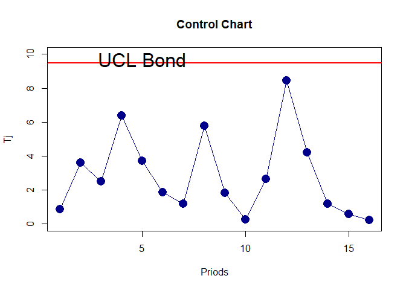
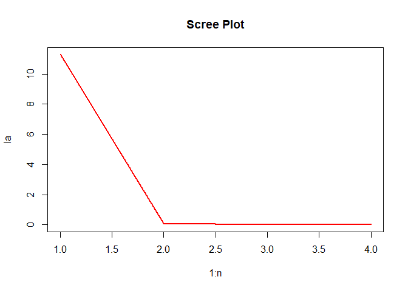

# Excercises of Season 8 (Applied Multivariate Statistical Analysis
Johnson)

------------------------------------------------------------------------

------------------------------------------------------------------------

<br><br>

### Ex. xi.

8.11. Consider the census-tract data listed in Table 8.5. Suppose the
observations on X<sub>5</sub> = median value home were recorded in ten
thousands, rather than hundred thousands, of dollars; that is, multiply
all the numbers listed in the sixth column of the table by 10. (a)
Construct the sample covariance matrix S for the census-tract data when
X<sub>5</sub> = median value home is recorded in ten thousands of
dollars. (Note that this. covariance matrix can be obtained from the
covariance matrix given in Example 8.3 by multiplying the off-diagonal
elements in the fifth column and row by 10 and the diagonal element
s<sub>55</sub> by 100. Why?)

2)  Obtain the eigenvalue-eigenvector pairs and the first two sample
    principal components for the covariance matrix in Part a.

3)  Compute the proportion of total variance explained by the first two
    principal components obtained in Part b. Calculate the correlation
    coefficients, $r_{\hat{Y}_j, x_k}$, and interpret these components
    if possible. Compare your results with the results in Example 8.3.
    What. can you say about the effects of this change in scale on the
    principal components?

<br><br>

##### Soloution:

###### (a):

``` r
S <- matrix(c(3.397, -1.102, 4.306, -2.078, 0.027, 
            -1.102, 9.673, -1.513, 10.953, 1.203, 
            4.306, -1.513, 55.626, -28.937, -0.044, 
            -2.078, 10.953, -28.937, 89.067, 0.957, 
            0.027, 1.203, -0.044, 0.957, 0.319), 
            byrow = T, nrow = 5, ncol = 5)

S[, 5] <- 10 * S[, 5]
S[5, ] <- 10 * S[5, ]

print(S)
```

           [,1]   [,2]    [,3]    [,4]  [,5]
    [1,]  3.397 -1.102   4.306  -2.078  0.27
    [2,] -1.102  9.673  -1.513  10.953 12.03
    [3,]  4.306 -1.513  55.626 -28.937 -0.44
    [4,] -2.078 10.953 -28.937  89.067  9.57
    [5,]  0.270 12.030  -0.440   9.570 31.90

<br><br>

###### (b):

``` r
E <- eigen(S)
la <- E$values
v <- E$vectors

la
```

    [1] 108.272  43.145  31.294   4.601   2.350

``` r
v
```

             [,1]    [,2]     [,3]     [,4]     [,5]
    [1,]  0.03763 0.06226 -0.04008 -0.55451  0.82802
    [2,] -0.11893 0.24944  0.25986  0.76915  0.51431
    [3,]  0.47967 0.75925 -0.43140  0.02791 -0.08108
    [4,] -0.85890 0.31598 -0.39397 -0.06882 -0.04988
    [5,] -0.12899 0.50755  0.76782 -0.30889 -0.20200

$$
\begin{aligned}
& \hat{y}_1 = -0.038 x_1 + 0.119  x_2 - 0.480  x_3 + 0.859 x_4 + 0.129 x_5\\
& \hat{y}_2 = -0.062 x_1 - 0.249 x_2 - 0.759 x_3 - 0.316 x_4 - 0.508 x_5
\end{aligned}
$$

<br><br>

###### (c):

``` r
cor_mat <- matrix(0, nrow = 2, ncol = 5)

for (i in 1:2) { 
    for (j in 1: 5) {
        temp <- v[, i]
        cor_mat[i, j] <- sqrt(la[i]) * temp[j] / sqrt(S[j, j])
    }
}
cor_mat
```

           [,1]    [,2]   [,3]    [,4]    [,5]
    [1,] 0.2124 -0.3979 0.6692 -0.9470 -0.2376
    [2,] 0.2219  0.5268 0.6687  0.2199  0.5903

<br><br>

``` r
cumsum(la) / sum(la)
```

    [1] 0.5709 0.7983 0.9633 0.9876 1.0000

<br>

------------------------------------------------------------------------

------------------------------------------------------------------------

<br>

### Ex. xiii.

8.13. In the radiotherapy data listed in Table 1.7 (see also the
radiotherapy data), the n = 98 observations on p = 6 variables rep-
resent patients’ reactions to radiotherapy. (a) Obtain the covariance
and correlation matrices S and R for these data. (b) Pick one of the
matrices S or R (justify your choice), and determine the eigenval- ues
and eigenvectors. Prepare a table showing, in decreasing order of size,
the per- cent that each eigenvalue contributes to the total sample
variance. (c) Given the results in Part b, decide on the number of
important sample principal components. Is it possible to summarize the
radiotherapy data with a single reaction- index component? Explain. (d)
Prepare a table of the correlation coefficients between each principal
component you decide to retain and the original variables. If possible,
interpret the components.

<br><br>

#### Soloution:

###### load data

``` r
dat <- read.table("Johnson_Data/table_1_7.txt", header = FALSE)

names(dat) <- paste("x", 1:6, sep = "_")
head(dat)
```

        x_1   x_2   x_3   x_4   x_5 x_6
    1 0.889 1.389 1.555 2.222 1.945   1
    2 2.813 1.437 0.999 2.312 2.312   2
    3 1.454 1.091 2.364 2.455 2.909   3
    4 0.294 0.941 1.059 2.000 1.000   1
    5 2.727 2.545 2.819 2.727 4.091   0
    6 3.937 1.250 1.937 2.937 3.749   1

``` r
head(dat)
```

        x_1   x_2   x_3   x_4   x_5 x_6
    1 0.889 1.389 1.555 2.222 1.945   1
    2 2.813 1.437 0.999 2.312 2.312   2
    3 1.454 1.091 2.364 2.455 2.909   3
    4 0.294 0.941 1.059 2.000 1.000   1
    5 2.727 2.545 2.819 2.727 4.091   0
    6 3.937 1.250 1.937 2.937 3.749   1

###### (a):

``` r
R <- cor(dat)
S <- cov(dat)


print(R)
```

            x_1     x_2    x_3     x_4      x_5      x_6
    x_1 1.00000  0.5514 0.3616 0.38627  0.53656  0.07898
    x_2 0.55144  1.0000 0.1875 0.45544  0.53501 -0.03420
    x_3 0.36158  0.1875 1.0000 0.34639  0.49578  0.15697
    x_4 0.38627  0.4554 0.3464 1.00000  0.70465  0.07073
    x_5 0.53656  0.5350 0.4958 0.70465  1.00000 -0.01023
    x_6 0.07898 -0.0342 0.1570 0.07073 -0.01023  1.00000

``` r
print(S)
```

           x_1      x_2    x_3     x_4       x_5       x_6
    x_1 4.6548  0.93135 0.5897 0.27692  1.074886  0.158151
    x_2 0.9313  0.61282 0.1109 0.11847  0.388886 -0.024852
    x_3 0.5897  0.11093 0.5714 0.08700  0.347990  0.110131
    x_4 0.2769  0.11847 0.0870 0.11041  0.217406  0.021814
    x_5 1.0749  0.38889 0.3480 0.21741  0.862172 -0.008818
    x_6 0.1582 -0.02485 0.1101 0.02181 -0.008818  0.861456

------------------------------------------------------------------------

###### (b):

``` r
Sigg <- diag(S)
print(Sigg)
```

       x_1    x_2    x_3    x_4    x_5    x_6 
    4.6548 0.6128 0.5714 0.1104 0.8622 0.8615 

As we can see, the variance values ​​of the variables in the data set are
not very harmonious, four of the variables have variances less than one
and one of them has a variance greater than four, so we use the S matrix
to implement a principal components model.

``` r
Es <- eigen(S)$values
ER <- eigen(R)$values

## Eigen values
print(Es)
```

    [1] 5.28338 0.88731 0.76752 0.43491 0.24953 0.05038

``` r
print(ER)
```

    [1] 2.8643 1.0764 0.7776 0.6503 0.3880 0.2433

``` r
## Eigen Vectors 
Vs <- eigen(S)$vectors
print(Vs)
```

            [,1]     [,2]     [,3]     [,4]     [,5]     [,6]
    [1,] 0.92849 -0.01984  0.34897  0.11153 -0.05642  0.01085
    [2,] 0.21162  0.16899 -0.22680 -0.71010  0.60716 -0.04831
    [3,] 0.14238 -0.15094 -0.50212  0.63510  0.54884  0.01560
    [4,] 0.06797  0.01498 -0.20314 -0.08586 -0.12742  0.96451
    [5,] 0.25883  0.14376 -0.72596 -0.11289 -0.55385 -0.25659
    [6,] 0.03538 -0.96300 -0.07982 -0.24465 -0.06297 -0.03444

``` r
VR <- eigen(R)$vectors
print(VR)
```

             [,1]     [,2]    [,3]     [,4]     [,5]     [,6]
    [1,] -0.44486 -0.02666 -0.3393  0.55115  0.60085 -0.14649
    [2,] -0.42930 -0.29174 -0.4986  0.06137 -0.68730 -0.07641
    [3,] -0.35877  0.38013  0.6282  0.42106 -0.33184 -0.21164
    [4,] -0.46285 -0.02096  0.1246 -0.66560  0.20741 -0.53269
    [5,] -0.52128 -0.07369  0.2033 -0.20053  0.10318  0.79413
    [6,] -0.05588  0.87396 -0.4299 -0.17872 -0.05309  0.11626

``` r
## sort eigenvalues 

Es1 <- sort(Es, decreasing = T)
Er1 <- sort(ER, decreasing = T)

## Table for EigenValues of Covariance Matrix 
round((Es1 / sum(Es1) * 100) , 4)
```

    [1] 68.8564 11.5641 10.0029  5.6680  3.2520  0.6566

``` r
## table for EigenValues of Correlation Matrix
round((Er1 / sum(Er1) * 100) , 4)
```

    [1] 47.739 17.941 12.961 10.839  6.467  4.054

``` r
round((cumsum(Er1) / sum(Er1) * 100) , 4)
```

    [1]  47.74  65.68  78.64  89.48  95.95 100.00

``` r
abs(diff(Er1))
```

    [1] 1.7879 0.2988 0.1273 0.2623 0.1448

------------------------------------------------------------------------

------------------------------------------------------------------------

$$
r_{\hat{y}_i, ~ x_k} = \frac{\hat{e}_{k, i} \times \sqrt{\hat{\lambda}_i}}{\sqrt{s_{kk}}} \implies 
$$

``` r
mat_cor <- matrix(NA, 4, 6, dimnames = list(Pri = paste("y", 1:4, sep = ""), Var = paste("x", 1:6, sep = "")))

for (i in 1:4) {
    e <- Vs[, i]
    l <- Es[i]
    for (j in 1:6) {
        skk <- Sigg[j]
        mat_cor[i, j] = e[j] * sqrt(l) / sqrt(skk)
    }
}

round(mat_cor, 4)
```

        Var
    Pri       x1      x2      x3      x4      x5      x6
      y1  0.9892  0.6213  0.4329  0.4702  0.6407  0.0876
      y2 -0.0087  0.2034 -0.1881  0.0425  0.1458 -0.9773
      y3  0.1417 -0.2538 -0.5819 -0.5356 -0.6850 -0.0753
      y4  0.0341 -0.5982  0.5541 -0.1704 -0.0802 -0.1738

------------------------------------------------------------------------

------------------------------------------------------------------------

#### EX. xxv.

8.25. Refer to the police overtime hours data in Example 8.10. Construct
an alternate control chart, based on the sum of squares dU<sup>2</sup>,
to monitor the unexplained variation in the orig- inal observations
summarized by the additional principal components.

``` r
dat <- read.table("Johnson_Data/table_5_8.txt", header = F)
head(dat)
```

        V1   V2   V3    V4   V5   V6
    1 3387 2200 1181 14861  236 6187
    2 3109  875 3532 11367  310 7336
    3 2670  957 2502 13329 1182 6988
    4 3125 1758 4510 12328 1208 6964
    5 3469  868 3032 12847 1385 8425
    6 3120  398 2130 13979 1053 6778

``` r
R <- cor(dat)

model <- princomp(dat, cor = TRUE, scores = TRUE)

summary(model)
```

    Importance of components:
                           Comp.1 Comp.2 Comp.3  Comp.4  Comp.5  Comp.6
    Standard deviation     1.6239 1.1871 1.0605 0.72384 0.43144 0.34452
    Proportion of Variance 0.4395 0.2349 0.1875 0.08732 0.03102 0.01978
    Cumulative Proportion  0.4395 0.6744 0.8619 0.94919 0.98022 1.00000

``` r
Y <- model$loadings[]

Y <- model$scores

l <- eigen(R)$values

l2 <- l[3:6]
yy <- Y[, 3:6]
for (i in 4) {
    yy[, i] <- 1/sqrt(l2[i]) * yy[, i]
}
new_y <- apply(yy, 1, function(x) sum(x^2))

UCL <- qchisq(0.95, df = 4)

time <- 1:16


# library(httpgd); hgd(); hgd_browse()
plot(x = time, y = new_y, xlab = "Priods", ylab = "Tj", 
            main = "Control Chart", type = "o", 
                col = "darkblue", pch = 16, cex = 2, ylim = c(0, 10))
abline(h = UCL, lwd = 2, col = "red")
text(x = 5, y = UCL + 0.2, label = "UCL Bond", cex = 2)
```



------------------------------------------------------------------------

------------------------------------------------------------------------

### Ex. XXvii.

8.27. The pulp and paper properties data is given in Table 7.7. Using
the four paper variables, BL (breaking length), EM (elastic modulus), SF
(Stress at failure) and BS (burst strength), perform a principal
component analysis using the covariance matrix S and the correlation
matrix R. Your analysis should include the following: (a) Determine the
appropriate number of components to effectively summarize the
variability. Construct a scree plot to aid in your determination.

2)  Interpret the sample principal components.

3)  Do you think it it is possible to develop a “paper strength” index
    that effectively con- tains the information in the four paper
    variables? Explain.

4)  Using the values for the first two principal components, plot the
    data in a two- dimensional space with ŷ1 along the vertical axis and
    ŷ2 along the horizontal axis. Identify any outliers in this data
    set.

##### Soloution

###### (a):

``` r
datt <- data.frame(
    Y1 = c(21.312, 21.206, 20.709, 19.542, 20.449, 
    20.841, 19.06, 18.597, 19.346, 18.72, 18.587, 19.813, 19.989, 
    19.116, 18.769, 18.708, 19.323, 17.433, 19.195, 19.436, 20.136, 
    16.74, 18.589, 19.422, 24.42, 25.288, 26.119, 23.113, 25.209, 
    25.444, 23.699, 24.303, 24.793, 23.438, 24.197, 24.741, 24.17, 
    24.174, 25.052, 23.846, 24.822, 25.2, 23.695, 24.941, 25.007, 
    21.183, 21.875, 22.095, 25.166, 24.56, 22.007, 21.115, 26.194, 
    25.674, 25.93, 21.39, 18.441, 16.441, 16.294, 20.289, 17.163, 
    20.289), 
    Y2 = c(7.039, 6.979, 6.779, 6.601, 6.795, 6.919, 6.447, 
    6.261, 6.572, 6.455, 6.295, 6.775, 6.737, 6.512, 6.335, 6.271, 
    6.55, 5.948, 6.213, 6.387, 6.725, 6.168, 6.531, 6.615, 7.874, 
    8.034, 8.222, 7.288, 7.955, 8.045, 7.593, 7.775, 8.123, 7.65, 
    7.794, 7.996, 7.766, 7.877, 8.287, 7.639, 8.041, 8.27, 7.46, 
    7.929, 8.081, 7.156, 7.336, 7.447, 7.913, 7.854, 8.259, 7.913, 
    8.454, 8.208, 8.1, 7.475, 6.652, 6.315, 6.572, 7.719, 7.086, 
    7.437), 
    Y3 = c(5.326, 5.237, 5.06, 4.479, 4.912, 5.108, 4.246, 
    4.032, 4.358, 4.072, 4.068, 4.604, 4.686, 4.299, 4.089, 3.978, 
    4.404, 3.486, 4.3, 4.404, 4.723, 3.201, 3.989, 4.382, 6.999, 
    7.406, 7.771, 6.329, 7.296, 7.477, 6.609, 6.861, 7.202, 6.457, 
    6.833, 7.152, 6.846, 6.826, 7.332, 6.615, 7.129, 7.356, 6.567, 
    7.286, 7.287, 5.388, 5.762, 5.79, 7.211, 7.02, 7.322, 6.557, 
    7.816, 7.534, 7.669, 5.294, 3.946, 2.997, 3.017, 4.866, 3.396, 
    4.859), 
    Y4 = c(0.932, 0.871, 0.742, 0.513, 0.577, 0.784, 0.358, 
    0.215, 0.432, 0.372, 0.239, 0.637, 0.779, 0.588, 0.47, 0.457, 
    0.588, 0.104, 0.405, 0.519, 0.652, 0.104, 0.336, 0.432, 1.73, 
    1.873, 1.946, 1.513, 1.792, 1.847, 1.482, 1.583, 1.703, 1.477, 
    1.583, 1.728, 1.615, 1.692, 1.773, 1.56, 1.721, 1.785, 1.543, 
    1.703, 1.787, 0.924, 1.068, 1.182, 1.813, 1.701, 1.169, 0.928, 
    2.145, 2.046, 2.037, 0.875, 0.14, -0.4, -0.478, 0.239, -0.236, 
    0.47))

dim(datt)
```

    [1] 62  4

``` r
S <- cov(datt)

E <- eigen(S)
la <- E$values
v <- E$vectors
n <- length(la)
plot(x = 1:n, y = la, type = "l", main = "Scree Plot", 
        lwd = 2, col = "red")
```



``` r
cumsum(la) / sum(la)
```

    [1] 0.9876 0.9967 0.9995 1.0000

<br>

###### (b):

``` r
Model <- princomp(datt, cor = TRUE, scores = TRUE)

Model
```

    Call:
    princomp(x = datt, cor = TRUE, scores = TRUE)

    Standard deviations:
    Comp.1 Comp.2 Comp.3 Comp.4 
    1.9595 0.3746 0.1123 0.0871 

     4  variables and  62 observations.

``` r
summary(Model)
```

    Importance of components:
                           Comp.1  Comp.2   Comp.3   Comp.4
    Standard deviation     1.9595 0.37457 0.112267 0.087099
    Proportion of Variance 0.9599 0.03508 0.003151 0.001897
    Cumulative Proportion  0.9599 0.99495 0.998103 1.000000

``` r
cor(datt)
```

           Y1     Y2     Y3     Y4
    Y1 1.0000 0.9138 0.9839 0.9876
    Y2 0.9138 1.0000 0.9422 0.8747
    Y3 0.9839 0.9422 1.0000 0.9745
    Y4 0.9876 0.8747 0.9745 1.0000

<br>

###### (d):

``` r
Y <- Model$scores
dim(Y)
```

    [1] 62  4

``` r
y1 <- Y[, 1]
y2 <- Y[, 2]

plot(x = y1, y = y2, cex = 3, col = "red", pch = 16)
```


