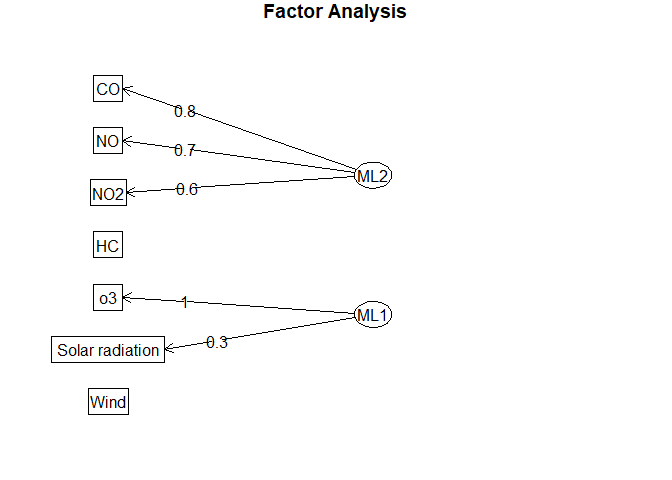
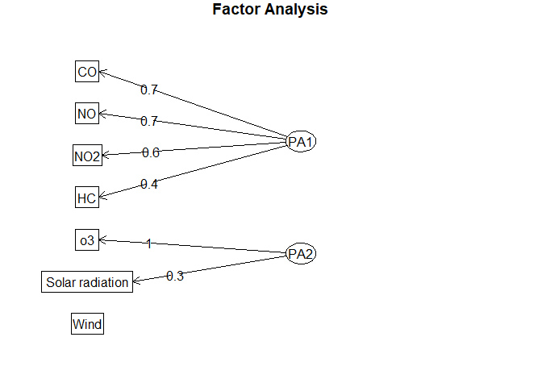

# Excercises of Season 9


#### Ex. iv.

9.4. Given $\rho$ and $\psi$ in Exercise 9.1 and an m = 1 factor model,
calculate the reduced correlation matrix $\tilde{\rho} = \rho - \psi$
and the principal factor solution for the loading matrix L. Is the
result consistent with the information in Exercise 9.1? Should it be?

###### Soloution

``` r
rho <- matrix(c(1, 0.63, 0.45, 0.63, 1, 
                .35, .45, .35, 1), 3, 3, byrow = T)
rho
```

         [,1] [,2] [,3]
    [1,] 1.00 0.63 0.45
    [2,] 0.63 1.00 0.35
    [3,] 0.45 0.35 1.00

``` r
psi <- diag(c(0.19, 0.51, 0.75), 3)
psi
```

         [,1] [,2] [,3]
    [1,] 0.19 0.00 0.00
    [2,] 0.00 0.51 0.00
    [3,] 0.00 0.00 0.75

``` r
L <- matrix(c(0.9, 0.7, 0.5), 3, 1)
ll <- L %*% t(L)

le <- eigen(rho)$values
ve <- eigen(rho)$vectors
ress <- rho - psi

all(ress - ll < 1e-10)
```

    [1] TRUE

<br>

------------------------------------------------------------------------

------------------------------------------------------------------------

------------------------------------------------------------------------

### EX. 9.6

$$
\begin{aligned}
& \text{Verify the following matrix identities}\\
& a:\quad (I + L' \Psi^{-1} L)^{-1} L' \Psi^{-1} L = I - (I + L' \Psi^{-1} L)^{-1} \\
& \text{Hint: Premultiply both sides by} ~(I + L' \Psi^{-1}L).\\
& b: \quad  (LL' +  \Psi)^{-1} =  \Psi^{-1} -  \Psi^{-1}(I +  L'\Psi^{-1}L)^{-1}L'\Psi^{-1} \\
& \text{Hint: Postmultiply both sides by} ~ (LL' + \Psi) ~\text{and use (a)}. \\
& c: \quad L'(LL' + \Psi)^{-1}= (I+L'\Psi^{-1}L)^{-1}L'\Psi^{-l} \\
& \text{Hint: Postmultiply the result in (b) by L, use (a),} \\
& \text{and take the transpose, noting that.} \\
& (LL'+\psi)^{-l},\psi^{−l}, \\
& \text{and} ~~ (I+L'\psi^{−l}) \\
& \text{are symmetric matrices.}\\
\end{aligned}
$$

#### Soloution

a:

$$
\begin{aligned}
& (I + L'\Psi^{-1}L) \times (I + L'\Psi^{-1}L)^{-1}L'\Psi^{-1}L = \\
& L'\Psi^{-1} L, \quad (I + L'\Psi^{-1}L) \times (I - (I + L'\Psi^{-1}L)^{-1}) = \\
& (I + L'\Psi^{-1}L) - I = L'\Psi^{-1}L
\end{aligned}
$$

b:

$$
\begin{aligned}
& (LL' + \Psi)^{-1} \times (LL' + \Psi)   = I \implies \\
& (\Psi^{-1} -  \Psi^{-1}(I +  L'\Psi^{-1}L)^{-1}L'\Psi^{-1})\times (LL' + \Psi) = \\ 
& (\Psi^{-1} - \Psi^{-1}L(I + L'\Psi^{-1}L)^{-1}L'\Psi^{-1}) (LL'+ \Psi) = \\
& \Psi^{-1}(LL' + \Psi) - \Psi^{-1} \underset{\text{Using part a}}{\underbrace{L(I + L'\Psi^{-1}L)^{-1}L'\Psi^{-1}}}(LL'+\Psi) \\
& = \Psi^{-1}(LL'+\Psi) - \Psi^{-1}L(I - (I + L'\Psi^{-1}L)^{-1})L' \\
& = \Psi^{-1}L(I + L'\Psi^{-1}L)^{-1}L' = I
\end{aligned}
$$

Note: all these Muliplication steps are reversible

*c*:

Muliplying the result in (b) by L we get

$$
\begin{aligned}
& (LL' + \Psi)^{-1} L = \Psi^{-1} L - \Psi^{-1}L\underset{\text{Use part a}}{\underbrace{(I + L'\Psi^{-1}L)^{-1}L'\Psi^{-1}}} = \\
& = \Psi^{-1} L - \Psi^{-1} L(I - (I = L'\Psi^{-1}L)^{-1}) = \\
& \Psi^{-1}L(I + L'\Psi^{-1}L)^{-1}
\end{aligned}
$$

Result follows by taking the transpose of both sides of the final
equality.

------------------------------------------------------------------------

------------------------------------------------------------------------

------------------------------------------------------------------------

### EX. 9.8

9.8. (Unique but improper solution: Heywood case.) Consider an m = 1
factor model for the population with covariance matrix

$$
\left[\begin{array}{ccc}
1 & 0.4 & 0.9 \\
0.4 & 1 & 0.7 \\
0.9 & 0.7 & 1
\end{array}\right]
$$

Show that there is a unique choice of $L$ and $\Psi$ with
$\Sigma = L \times L^T + \Psi$, but that $\psi < 0$, so the choice is
not admissible

###### Soloution:

$$
\begin{aligned}
& \Sigma = LL' + \Psi \quad \text{for} ~m = 1 \implies \\
& \Sigma = \left[\begin{array}{ccc} 
1 = L_{11}^2 + \psi_1 & 0.4 = L_{11} \times L_{21} & 0.9 = L_{11} \times L_{31} \\
0.4 = L_{11} \times L_{21} &  1 = L_{21}^2 + \psi_2 & 0.7 = L_{21}\times L_{31} \\
0.9 = L_{11} \times L_{31} & 0.7 = L_{21}\times L_{31} & 1 = L_{31}^2 + \psi_3
\end{array}\right] \implies \\
& \text{We Have:}\quad \frac{L_{11}}{L_{21}} = \frac{0.9}{0.7} ~\text{and}~L_{11} \times L_{21} = 0.4, ~ \text{So} \quad \\
& L_{11}^2 = \frac{0.9}{0.7} \times 0.4 ~ \text{and} ~ L_{11} = \pm 0.717 \implies\\
& \text{Thus}\quad L_{21} = \pm 0.558, \quad \text{Finally}\\
& \text{from}\quad 0.9 = L_{11}\times L_{31} \implies \\
& \text{We Have:}\quad L_{31} = \pm \frac{0.9}{0.717} = \pm 1.255
\end{aligned}
$$

Note all the loadings must be of the same sign because all the
covariances are positive. We have

$$
\begin{aligned}
& L\times L^T = \left[\begin{array}{c} 0.717 \\ 0.558 \\ 1.255\end{array}\right] \times \left[\begin{array}{r}0.717 & 0.558 & 1.255\end{array}\right] = \\
& \left[\begin{array}{ccc} 0.514 & 0.4 & 0.9 \\ 0.4 & 0.3111 & 0.7 \\
0.9 & 0.7 & 1.575 \end{array}\right] \implies \\
& \text{So} \quad \psi_3 = 1  - 1.575 = -0.575 < 0 \text{which is inadmissible as a variance.}
\end{aligned}
$$

------------------------------------------------------------------------

------------------------------------------------------------------------

------------------------------------------------------------------------

### EX 9.12.

``` r
dat = read.table('./Johnson_Data/table_9_12.txt', 
    header = TRUE, row.names = NULL)

names(dat) = c(
    'SalesGrowth', 
    'SalesProfitability', 
    'NewAccountSales', 
    'CreativityTest', 
    'MechanicalReasoningTest', 
    'AbstractReasoningTest', 
    'MathematicsTest'
)
dat[, 1] <- as.numeric(dat[, 1])
dim(dat)
```

    [1] 50  7

``` r
head(dat)
```

      SalesGrowth SalesProfitability NewAccountSales CreativityTest
    1        93.0               96.0            97.8              9
    2        88.8               91.8            96.8              7
    3        95.0              100.3            99.0              8
    4       101.3              103.8           106.8             13
    5       102.0              107.8           103.0             10
    6        95.8               97.5            99.3             10
      MechanicalReasoningTest AbstractReasoningTest MathematicsTest
    1                      12                     9              20
    2                      10                    10              15
    3                      12                     9              26
    4                      14                    12              29
    5                      15                    12              32
    6                      14                    11              21

#### (a)

``` r
any(is.na(dat))
```

    [1] FALSE

``` r
dat_scale <- sapply(dat, FUN = function(x) (x - mean(x))/sd(x))

# install.packages('psych')
library(psych)
KMO(cor(dat_scale))
```

    Kaiser-Meyer-Olkin factor adequacy
    Call: KMO(r = cor(dat_scale))
    Overall MSA =  0.62
    MSA for each item = 
                SalesGrowth      SalesProfitability         NewAccountSales 
                       0.66                    0.78                    0.63 
             CreativityTest MechanicalReasoningTest   AbstractReasoningTest 
                       0.41                    0.75                    0.42 
            MathematicsTest 
                       0.63 

``` r
cortest.bartlett(R = cor(dat_scale), n = 50)
```

    $chisq
    [1] 499.6613

    $p.value
    [1] 1.737779e-92

    $df
    [1] 21

``` r
FaModel1 <- factanal(dat_scale, factors = 2, 
    method = "mle", rotation = 'none')
FaModel2 <- factanal(dat_scale, factors = 3, 
    method = 'mle', rotation = 'none')
```

``` r
FaModel1
```


    Call:
    factanal(x = dat_scale, factors = 2, rotation = "none", method = "mle")

    Uniquenesses:
                SalesGrowth      SalesProfitability         NewAccountSales 
                      0.069                   0.070                   0.123 
             CreativityTest MechanicalReasoningTest   AbstractReasoningTest 
                      0.005                   0.474                   0.614 
            MathematicsTest 
                      0.029 

    Loadings:
                            Factor1 Factor2
    SalesGrowth              0.695   0.669 
    SalesProfitability       0.669   0.695 
    NewAccountSales          0.795   0.494 
    CreativityTest           0.983  -0.167 
    MechanicalReasoningTest  0.655   0.312 
    AbstractReasoningTest    0.250   0.569 
    MathematicsTest          0.558   0.812 

                   Factor1 Factor2
    SS loadings      3.333   2.283
    Proportion Var   0.476   0.326
    Cumulative Var   0.476   0.802

    Test of the hypothesis that 2 factors are sufficient.
    The chi square statistic is 117.2 on 8 degrees of freedom.
    The p-value is 1.25e-21 

``` r
FaModel2
```


    Call:
    factanal(x = dat_scale, factors = 3, rotation = "none", method = "mle")

    Uniquenesses:
                SalesGrowth      SalesProfitability         NewAccountSales 
                      0.039                   0.034                   0.088 
             CreativityTest MechanicalReasoningTest   AbstractReasoningTest 
                      0.005                   0.447                   0.005 
            MathematicsTest 
                      0.038 

    Loadings:
                            Factor1 Factor2 Factor3
    SalesGrowth              0.901   0.381         
    SalesProfitability       0.775   0.600         
    NewAccountSales          0.931   0.202         
    CreativityTest           0.733  -0.118   0.666 
    MechanicalReasoningTest  0.689   0.225   0.169 
    AbstractReasoningTest    0.757  -0.132  -0.636 
    MathematicsTest          0.762   0.608  -0.110 

                   Factor1 Factor2 Factor3
    SS loadings      4.445   0.998   0.901
    Proportion Var   0.635   0.143   0.129
    Cumulative Var   0.635   0.778   0.906

    Test of the hypothesis that 3 factors are sufficient.
    The chi square statistic is 62.18 on 3 degrees of freedom.
    The p-value is 2.01e-13 

#### (b)

``` r
FaModel_rotate_1 <- factanal(dat_scale, factors = 2, 
    method = "mle", rotation = "varimax")
FaModel_rotate_2 <- factanal(dat_scale, factors = 3, 
    method = 'mle', rotation = 'varimax')
```

``` r
FaModel_rotate_1$loadings[]
```

                              Factor1    Factor2
    SalesGrowth             0.8521502 0.45238076
    SalesProfitability      0.8684331 0.41885805
    NewAccountSales         0.7172312 0.60188785
    CreativityTest          0.1476020 0.98652205
    MechanicalReasoningTest 0.5007545 0.52503052
    AbstractReasoningTest   0.6186809 0.05996736
    MathematicsTest         0.9458237 0.27676783

``` r
FaModel_rotate_2$loadings[]
```

                              Factor1    Factor2    Factor3
    SalesGrowth             0.7934765 0.37388588 0.43821544
    SalesProfitability      0.9114852 0.31705385 0.18490774
    NewAccountSales         0.6513180 0.54393083 0.43794945
    CreativityTest          0.2550455 0.96416391 0.01957362
    MechanicalReasoningTest 0.5420340 0.46542526 0.20726918
    AbstractReasoningTest   0.2991398 0.05399518 0.95006924
    MathematicsTest         0.9174074 0.17964111 0.29762860

#### (c)

``` r
LModel1 <- FaModel_rotate_1$loadings[]
LModel2 <- FaModel_rotate_2$loadings[]
communalities1 <- rowSums(LModel1^2)
communalities2 <- rowSums(LModel2^2)
communalities1
```

                SalesGrowth      SalesProfitability         NewAccountSales 
                  0.9308083               0.9296182               0.8766896 
             CreativityTest MechanicalReasoningTest   AbstractReasoningTest 
                  0.9950121               0.5264121               0.3863622 
            MathematicsTest 
                  0.9711829 

``` r
communalities2
```

                SalesGrowth      SalesProfitability         NewAccountSales 
                  0.9614284               0.9655192               0.9118756 
             CreativityTest MechanicalReasoningTest   AbstractReasoningTest 
                  0.9950434               0.5533820               0.9950317 
            MathematicsTest 
                  0.9624901 

``` r
specific_variances1 <- 1 - communalities1
specific_variances2 <- 1 - communalities2
specific_variances1
```

                SalesGrowth      SalesProfitability         NewAccountSales 
                0.069191662             0.070381824             0.123310363 
             CreativityTest MechanicalReasoningTest   AbstractReasoningTest 
                0.004987889             0.473587898             0.613637835 
            MathematicsTest 
                0.028817139 

``` r
specific_variances2
```

                SalesGrowth      SalesProfitability         NewAccountSales 
                0.038571561             0.034480799             0.088124391 
             CreativityTest MechanicalReasoningTest   AbstractReasoningTest 
                0.004956640             0.446617961             0.004968311 
            MathematicsTest 
                0.037509883 

#### (d)

``` r
n = 50
p = 7
m1 = 2
m2 = 3
(Psi1 <- diag(specific_variances1))
```

               [,1]       [,2]      [,3]        [,4]      [,5]      [,6]       [,7]
    [1,] 0.06919166 0.00000000 0.0000000 0.000000000 0.0000000 0.0000000 0.00000000
    [2,] 0.00000000 0.07038182 0.0000000 0.000000000 0.0000000 0.0000000 0.00000000
    [3,] 0.00000000 0.00000000 0.1233104 0.000000000 0.0000000 0.0000000 0.00000000
    [4,] 0.00000000 0.00000000 0.0000000 0.004987889 0.0000000 0.0000000 0.00000000
    [5,] 0.00000000 0.00000000 0.0000000 0.000000000 0.4735879 0.0000000 0.00000000
    [6,] 0.00000000 0.00000000 0.0000000 0.000000000 0.0000000 0.6136378 0.00000000
    [7,] 0.00000000 0.00000000 0.0000000 0.000000000 0.0000000 0.0000000 0.02881714

``` r
(Psi2 <- diag(specific_variances2))
```

               [,1]      [,2]       [,3]       [,4]     [,5]        [,6]       [,7]
    [1,] 0.03857156 0.0000000 0.00000000 0.00000000 0.000000 0.000000000 0.00000000
    [2,] 0.00000000 0.0344808 0.00000000 0.00000000 0.000000 0.000000000 0.00000000
    [3,] 0.00000000 0.0000000 0.08812439 0.00000000 0.000000 0.000000000 0.00000000
    [4,] 0.00000000 0.0000000 0.00000000 0.00495664 0.000000 0.000000000 0.00000000
    [5,] 0.00000000 0.0000000 0.00000000 0.00000000 0.446618 0.000000000 0.00000000
    [6,] 0.00000000 0.0000000 0.00000000 0.00000000 0.000000 0.004968311 0.00000000
    [7,] 0.00000000 0.0000000 0.00000000 0.00000000 0.000000 0.000000000 0.03750988

``` r
(LL1 <- LModel1 %*% t(LModel1))
```

                            SalesGrowth SalesProfitability NewAccountSales
    SalesGrowth               0.9308083          0.9295188       0.8834712
    SalesProfitability        0.9295188          0.9296182       0.8749729
    NewAccountSales           0.8834712          0.8749729       0.8766896
    CreativityTest            0.5720627          0.5413952       0.6996404
    MechanicalReasoningTest   0.6642317          0.6547850       0.6751663
    AbstractReasoningTest     0.5543372          0.5624008       0.4798309
    MathematicsTest           0.9311883          0.9373111       0.8449575
                            CreativityTest MechanicalReasoningTest
    SalesGrowth                  0.5720627               0.6642317
    SalesProfitability           0.5413952               0.6547850
    NewAccountSales              0.6996404               0.6751663
    CreativityTest               0.9950121               0.5918666
    MechanicalReasoningTest      0.5918666               0.5264121
    AbstractReasoningTest        0.1504777               0.3412919
    MathematicsTest              0.4126431               0.6189370
                            AbstractReasoningTest MathematicsTest
    SalesGrowth                         0.5543372       0.9311883
    SalesProfitability                  0.5624008       0.9373111
    NewAccountSales                     0.4798309       0.8449575
    CreativityTest                      0.1504777       0.4126431
    MechanicalReasoningTest             0.3412919       0.6189370
    AbstractReasoningTest               0.3863622       0.6017601
    MathematicsTest                     0.6017601       0.9711829

``` r
(LL2 <- LModel2 %*% t(LModel2))
```

                            SalesGrowth SalesProfitability NewAccountSales
    SalesGrowth               0.9614284          0.9228135       0.9120898
    SalesProfitability        0.9228135          0.9655192       0.8471023
    NewAccountSales           0.9120898          0.8471023       0.9118756
    CreativityTest            0.5714373          0.5417813       0.6991264
    MechanicalReasoningTest   0.6949357          0.6799465       0.6969691
    AbstractReasoningTest     0.6738835          0.4654561       0.6402871
    MathematicsTest           0.9255320          0.9481930       0.8255826
                            CreativityTest MechanicalReasoningTest
    SalesGrowth                  0.5714373               0.6949357
    SalesProfitability           0.5417813               0.6799465
    NewAccountSales              0.6991264               0.6969691
    CreativityTest               0.9950434               0.5910466
    MechanicalReasoningTest      0.5910466               0.5533820
    AbstractReasoningTest        0.1469508               0.3841948
    MathematicsTest              0.4130097               0.6425648
                            AbstractReasoningTest MathematicsTest
    SalesGrowth                         0.6738835       0.9255320
    SalesProfitability                  0.4654561       0.9481930
    NewAccountSales                     0.6402871       0.8255826
    CreativityTest                      0.1469508       0.4130097
    MechanicalReasoningTest             0.3841948       0.6425648
    AbstractReasoningTest               0.9950317       0.5669006
    MathematicsTest                     0.5669006       0.9624901

``` r
(sig_estimate_1 <- Psi1 + LL1)
```

                            SalesGrowth SalesProfitability NewAccountSales
    SalesGrowth               1.0000000          0.9295188       0.8834712
    SalesProfitability        0.9295188          1.0000000       0.8749729
    NewAccountSales           0.8834712          0.8749729       1.0000000
    CreativityTest            0.5720627          0.5413952       0.6996404
    MechanicalReasoningTest   0.6642317          0.6547850       0.6751663
    AbstractReasoningTest     0.5543372          0.5624008       0.4798309
    MathematicsTest           0.9311883          0.9373111       0.8449575
                            CreativityTest MechanicalReasoningTest
    SalesGrowth                  0.5720627               0.6642317
    SalesProfitability           0.5413952               0.6547850
    NewAccountSales              0.6996404               0.6751663
    CreativityTest               1.0000000               0.5918666
    MechanicalReasoningTest      0.5918666               1.0000000
    AbstractReasoningTest        0.1504777               0.3412919
    MathematicsTest              0.4126431               0.6189370
                            AbstractReasoningTest MathematicsTest
    SalesGrowth                         0.5543372       0.9311883
    SalesProfitability                  0.5624008       0.9373111
    NewAccountSales                     0.4798309       0.8449575
    CreativityTest                      0.1504777       0.4126431
    MechanicalReasoningTest             0.3412919       0.6189370
    AbstractReasoningTest               1.0000000       0.6017601
    MathematicsTest                     0.6017601       1.0000000

``` r
(sig_estimate_2 <- Psi2 + LL2)
```

                            SalesGrowth SalesProfitability NewAccountSales
    SalesGrowth               1.0000000          0.9228135       0.9120898
    SalesProfitability        0.9228135          1.0000000       0.8471023
    NewAccountSales           0.9120898          0.8471023       1.0000000
    CreativityTest            0.5714373          0.5417813       0.6991264
    MechanicalReasoningTest   0.6949357          0.6799465       0.6969691
    AbstractReasoningTest     0.6738835          0.4654561       0.6402871
    MathematicsTest           0.9255320          0.9481930       0.8255826
                            CreativityTest MechanicalReasoningTest
    SalesGrowth                  0.5714373               0.6949357
    SalesProfitability           0.5417813               0.6799465
    NewAccountSales              0.6991264               0.6969691
    CreativityTest               1.0000000               0.5910466
    MechanicalReasoningTest      0.5910466               1.0000000
    AbstractReasoningTest        0.1469508               0.3841948
    MathematicsTest              0.4130097               0.6425648
                            AbstractReasoningTest MathematicsTest
    SalesGrowth                         0.6738835       0.9255320
    SalesProfitability                  0.4654561       0.9481930
    NewAccountSales                     0.6402871       0.8255826
    CreativityTest                      0.1469508       0.4130097
    MechanicalReasoningTest             0.3841948       0.6425648
    AbstractReasoningTest               1.0000000       0.5669006
    MathematicsTest                     0.5669006       1.0000000

``` r
(Sig_sample <- cov(dat_scale))
```

                            SalesGrowth SalesProfitability NewAccountSales
    SalesGrowth               1.0000000          0.9260758       0.8840023
    SalesProfitability        0.9260758          1.0000000       0.8425232
    NewAccountSales           0.8840023          0.8425232       1.0000000
    CreativityTest            0.5720363          0.5415080       0.7003630
    MechanicalReasoningTest   0.7080738          0.7459097       0.6374712
    AbstractReasoningTest     0.6744073          0.4653880       0.6410886
    MathematicsTest           0.9273116          0.9442960       0.8525682
                            CreativityTest MechanicalReasoningTest
    SalesGrowth                  0.5720363               0.7080738
    SalesProfitability           0.5415080               0.7459097
    NewAccountSales              0.7003630               0.6374712
    CreativityTest               1.0000000               0.5907360
    MechanicalReasoningTest      0.5907360               1.0000000
    AbstractReasoningTest        0.1469074               0.3859502
    MathematicsTest              0.4126395               0.5745533
                            AbstractReasoningTest MathematicsTest
    SalesGrowth                         0.6744073       0.9273116
    SalesProfitability                  0.4653880       0.9442960
    NewAccountSales                     0.6410886       0.8525682
    CreativityTest                      0.1469074       0.4126395
    MechanicalReasoningTest             0.3859502       0.5745533
    AbstractReasoningTest               1.0000000       0.5663721
    MathematicsTest                     0.5663721       1.0000000

``` r
(c1 <- (n - 1 - (2 * p + 4*m1 + 5)/6))
```

    [1] 44.5

``` r
(c2 <- (n - 1 - (2 * p + 4*m2 + 5)/6))
```

    [1] 43.83333

``` r
(det_ratio1 <- det(sig_estimate_1)/det(Sig_sample))
```

    [1] 13.95862

``` r
(det_ratio2 <- det(sig_estimate_2)/det(Sig_sample))
```

    [1] 4.192307

``` r
(chiModel1 <- c1 * log(det_ratio1))
```

    [1] 117.3063

``` r
(chiModel2 <- c2 * log(det_ratio2))
```

    [1] 62.82417

``` r
(df1 <- ((p - m1)^2 -p -m1)/2)
```

    [1] 8

``` r
(df2 <- ((p - m2)^2 -p -m2)/2)
```

    [1] 3

``` r
ifelse(chiModel1 > qchisq(0.01, df = df1, lower.tail = FALSE), "H0 for Model 1 Rejected", "H0 for Model 1 Accepted")
```

    [1] "H0 for Model 1 Rejected"

``` r
ifelse(chiModel2 > qchisq(0.01, df = df2, lower.tail = FALSE), "H0 for Model 2 Rejected", "H0 for Model 2 Accepted")
```

    [1] "H0 for Model 2 Rejected"

#### (e)

``` r
x <- c(110, 98, 105, 15, 18, 12, 35)

(SD <- sapply(dat, function(x) sd(x)))
```

                SalesGrowth      SalesProfitability         NewAccountSales 
                   7.337345               10.124315                4.712218 
             CreativityTest MechanicalReasoningTest   AbstractReasoningTest 
                   3.950149                3.384780                2.139617 
            MathematicsTest 
                  10.537707 

``` r
(Means <- colMeans(dat))
```

                SalesGrowth      SalesProfitability         NewAccountSales 
                     98.836                 106.622                 102.810 
             CreativityTest MechanicalReasoningTest   AbstractReasoningTest 
                     11.220                  14.180                  10.560 
            MathematicsTest 
                     29.760 

``` r
(zj <- (x - Means)/SD)
```

                SalesGrowth      SalesProfitability         NewAccountSales 
                  1.5215312              -0.8516132               0.4647493 
             CreativityTest MechanicalReasoningTest   AbstractReasoningTest 
                  0.9569260               1.1285815               0.6730178 
            MathematicsTest 
                  0.4972619 

``` r
# Weighted Least square
fModel1 <- solve(t(LModel1) %*% solve(Psi1) %*% LModel1) %*% 
    t(LModel1) %*% solve(Psi1) %*% zj
fModel1
```

                 [,1]
    Factor1 0.1118700
    Factor2 0.9507092

``` r
fModel2 <- solve(t(LModel2) %*% solve(Psi2) %*% LModel2) %*% 
    t(LModel2) %*% solve(Psi2) %*% zj
fModel2
```

                  [,1]
    Factor1 -0.3531352
    Factor2  1.0765410
    Factor3  0.8055177

``` r
fModel1_reg <- t(LModel1) %*% solve(Sig_sample) %*% zj
fModel2_reg <- t(LModel2) %*% solve(Sig_sample) %*% zj
fModel1_reg
```

                 [,1]
    Factor1 0.1145316
    Factor2 0.9454347

``` r
fModel2_reg
```

                  [,1]
    Factor1 -0.3286063
    Factor2  1.0631969
    Factor3  0.7927693

------------------------------------------------------------------------

------------------------------------------------------------------------

------------------------------------------------------------------------

### EX 9.21.

Perform a varimax rotation of both m = 2 solutions in Exercise 9.20.
Interpret the re- sults. Are the principal component and maximum
likelihood solutions consistent with each other?

#### Soloution

``` r
dat <- read.table(file = "Johnson_Data/table_1_5.txt", header = FALSE)
names(dat) <- c("Wind", 
            "Solar radiation", 
            "CO", 
            "NO", 
            "NO2", 
            "o3", 
            "HC")
head(dat)
```

      Wind Solar radiation CO NO NO2 o3 HC
    1    8              98  7  2  12  8  2
    2    7             107  4  3   9  5  3
    3    7             103  4  3   5  6  3
    4   10              88  5  2   8 15  4
    5    6              91  4  2   8 10  3
    6    8              90  5  2  12 12  4

``` r
# install.packages("psych")
library(psych)

maModel <- fa(dat, nfactors = 2, 
            rotate = "varimax", fm = "ml")


paModel <- fa(dat, nfactors = 2, 
            rotate = "varimax", fm = "pa")
```

    maximum iteration exceeded

    Warning in fa.stats(r = r, f = f, phi = phi, n.obs = n.obs, np.obs = np.obs, :
    The estimated weights for the factor scores are probably incorrect.  Try a
    different factor score estimation method.

    Warning in fac(r = r, nfactors = nfactors, n.obs = n.obs, rotate = rotate, : An
    ultra-Heywood case was detected.  Examine the results carefully

``` r
summary(maModel)
```


    Factor analysis with Call: fa(r = dat, nfactors = 2, rotate = "varimax", fm = "ml")

    Test of the hypothesis that 2 factors are sufficient.
    The degrees of freedom for the model is 8  and the objective function was  0.55 
    The number of observations was  42  with Chi Square =  20.21  with prob <  0.0096 

    The root mean square of the residuals (RMSA) is  0.1 
    The df corrected root mean square of the residuals is  0.16 

    Tucker Lewis Index of factoring reliability =  0.319
    RMSEA index =  0.189  and the 10 % confidence intervals are  0.089 0.3
    BIC =  -9.69

``` r
maModel$loadings[]
```

                            ML2        ML1
    Wind            -0.17631650 -0.2487687
    Solar radiation  0.05459543  0.3188815
    CO               0.79653840  0.3910129
    NO               0.69168162 -0.1523676
    NO2              0.60211064  0.1518022
    o3               0.02627196  0.9971519
    HC               0.25111015  0.1472988

``` r
summary(paModel)
```


    Factor analysis with Call: fa(r = dat, nfactors = 2, rotate = "varimax", fm = "pa")

    Test of the hypothesis that 2 factors are sufficient.
    The degrees of freedom for the model is 8  and the objective function was  0.58 
    The number of observations was  42  with Chi Square =  21.15  with prob <  0.0068 

    The root mean square of the residuals (RMSA) is  0.09 
    The df corrected root mean square of the residuals is  0.15 

    Tucker Lewis Index of factoring reliability =  0.266
    RMSEA index =  0.196  and the 10 % confidence intervals are  0.098 0.306
    BIC =  -8.76

``` r
paModel$loadings[]
```

                            PA1         PA2
    Wind            -0.18321873 -0.19445825
    Solar radiation  0.05168855  0.33535104
    CO               0.74404527  0.35899991
    NO               0.67109088 -0.14544651
    NO2              0.64617127  0.17103065
    o3               0.04450198  1.02437659
    HC               0.35655864  0.08149109

``` r
fa.diagram(maModel)
```



``` r
fa.diagram(paModel)
```



------------------------------------------------------------------------

------------------------------------------------------------------------

------------------------------------------------------------------------

### EX 9.21.

9.22. Refer to Exercise 9.20. (a) Calculate the factor scores from the m
= 2 maximum likelihood estimates by (i) weighted least squares in (9-50)
and (ii) the regression approach of (9-58). (b) Find the factor scores
from the principal component solution, using (9-51). (c) Compare the
three sets of factor scores.

#### Soloution

``` r
dataa <- read.table("Johnson_Data/table_1_5.txt", header = FALSE)
names(dataa) <- c("Wind", "Solar radiation", 
                "CO", "NO", "NO2", "o3", "HC")
head(dataa)
```

      Wind Solar radiation CO NO NO2 o3 HC
    1    8              98  7  2  12  8  2
    2    7             107  4  3   9  5  3
    3    7             103  4  3   5  6  3
    4   10              88  5  2   8 15  4
    5    6              91  4  2   8 10  3
    6    8              90  5  2  12 12  4

``` r
# Section (a): 1

# install.packages("psych")
library(psych)

# install.packages("GPArotation")
WssModel <- fa(dataa, nfactors = 2, fm = "ml", scores = "Bartlett")

WssModel
```

    Factor Analysis using method =  ml
    Call: fa(r = dataa, nfactors = 2, scores = "Bartlett", fm = "ml")
    Standardized loadings (pattern matrix) based upon correlation matrix
                      ML2   ML1    h2    u2 com
    Wind            -0.18 -0.21 0.093 0.907 2.0
    Solar radiation  0.06  0.31 0.105 0.895 1.1
    CO               0.82  0.22 0.787 0.213 1.1
    NO               0.71 -0.30 0.502 0.498 1.4
    NO2              0.62  0.02 0.386 0.614 1.0
    o3               0.03  0.99 0.995 0.005 1.0
    HC               0.26  0.09 0.085 0.915 1.3

                           ML2  ML1
    SS loadings           1.67 1.29
    Proportion Var        0.24 0.18
    Cumulative Var        0.24 0.42
    Proportion Explained  0.56 0.44
    Cumulative Proportion 0.56 1.00

     With factor correlations of 
         ML2  ML1
    ML2 1.00 0.21
    ML1 0.21 1.00

    Mean item complexity =  1.3
    Test of the hypothesis that 2 factors are sufficient.

    df null model =  21  with the objective function =  1.86 with Chi Square =  70.53
    df of  the model are 8  and the objective function was  0.55 

    The root mean square of the residuals (RMSR) is  0.1 
    The df corrected root mean square of the residuals is  0.16 

    The harmonic n.obs is  42 with the empirical chi square  16.76  with prob <  0.033 
    The total n.obs was  42  with Likelihood Chi Square =  20.21  with prob <  0.0096 

    Tucker Lewis Index of factoring reliability =  0.319
    RMSEA index =  0.189  and the 90 % confidence intervals are  0.089 0.3
    BIC =  -9.69
    Fit based upon off diagonal values = 0.87
    Measures of factor score adequacy             
                                                       ML2  ML1
    Correlation of (regression) scores with factors   0.91 1.00
    Multiple R square of scores with factors          0.83 0.99
    Minimum correlation of possible factor scores     0.66 0.99

``` r
summary(WssModel)
```


    Factor analysis with Call: fa(r = dataa, nfactors = 2, scores = "Bartlett", fm = "ml")

    Test of the hypothesis that 2 factors are sufficient.
    The degrees of freedom for the model is 8  and the objective function was  0.55 
    The number of observations was  42  with Chi Square =  20.21  with prob <  0.0096 

    The root mean square of the residuals (RMSA) is  0.1 
    The df corrected root mean square of the residuals is  0.16 

    Tucker Lewis Index of factoring reliability =  0.319
    RMSEA index =  0.189  and the 10 % confidence intervals are  0.089 0.3
    BIC =  -9.69
     With factor correlations of 
         ML2  ML1
    ML2 1.00 0.21
    ML1 0.21 1.00

``` r
WssModel$loadings[]
```

                            ML2         ML1
    Wind            -0.18026740 -0.21029346
    Solar radiation  0.05557986  0.30701894
    CO               0.81511129  0.21703998
    NO               0.70829556 -0.30354261
    NO2              0.61629210  0.02026408
    o3               0.02591211  0.99162180
    HC               0.25694154  0.09245860

``` r
# section(a): 2

##############
WssModel2 <- fa(dataa, nfactors = 2, fm = "ml", scores = "Thurstone")

WssModel2
```

    Factor Analysis using method =  ml
    Call: fa(r = dataa, nfactors = 2, scores = "Thurstone", fm = "ml")
    Standardized loadings (pattern matrix) based upon correlation matrix
                      ML2   ML1    h2    u2 com
    Wind            -0.18 -0.21 0.093 0.907 2.0
    Solar radiation  0.06  0.31 0.105 0.895 1.1
    CO               0.82  0.22 0.787 0.213 1.1
    NO               0.71 -0.30 0.502 0.498 1.4
    NO2              0.62  0.02 0.386 0.614 1.0
    o3               0.03  0.99 0.995 0.005 1.0
    HC               0.26  0.09 0.085 0.915 1.3

                           ML2  ML1
    SS loadings           1.67 1.29
    Proportion Var        0.24 0.18
    Cumulative Var        0.24 0.42
    Proportion Explained  0.56 0.44
    Cumulative Proportion 0.56 1.00

     With factor correlations of 
         ML2  ML1
    ML2 1.00 0.21
    ML1 0.21 1.00

    Mean item complexity =  1.3
    Test of the hypothesis that 2 factors are sufficient.

    df null model =  21  with the objective function =  1.86 with Chi Square =  70.53
    df of  the model are 8  and the objective function was  0.55 

    The root mean square of the residuals (RMSR) is  0.1 
    The df corrected root mean square of the residuals is  0.16 

    The harmonic n.obs is  42 with the empirical chi square  16.76  with prob <  0.033 
    The total n.obs was  42  with Likelihood Chi Square =  20.21  with prob <  0.0096 

    Tucker Lewis Index of factoring reliability =  0.319
    RMSEA index =  0.189  and the 90 % confidence intervals are  0.089 0.3
    BIC =  -9.69
    Fit based upon off diagonal values = 0.87
    Measures of factor score adequacy             
                                                       ML2  ML1
    Correlation of (regression) scores with factors   0.91 1.00
    Multiple R square of scores with factors          0.83 0.99
    Minimum correlation of possible factor scores     0.66 0.99

``` r
summary(WssModel2)
```


    Factor analysis with Call: fa(r = dataa, nfactors = 2, scores = "Thurstone", fm = "ml")

    Test of the hypothesis that 2 factors are sufficient.
    The degrees of freedom for the model is 8  and the objective function was  0.55 
    The number of observations was  42  with Chi Square =  20.21  with prob <  0.0096 

    The root mean square of the residuals (RMSA) is  0.1 
    The df corrected root mean square of the residuals is  0.16 

    Tucker Lewis Index of factoring reliability =  0.319
    RMSEA index =  0.189  and the 10 % confidence intervals are  0.089 0.3
    BIC =  -9.69
     With factor correlations of 
         ML2  ML1
    ML2 1.00 0.21
    ML1 0.21 1.00

``` r
WssModel2$loadings[]
```

                            ML2         ML1
    Wind            -0.18026740 -0.21029346
    Solar radiation  0.05557986  0.30701894
    CO               0.81511129  0.21703998
    NO               0.70829556 -0.30354261
    NO2              0.61629210  0.02026408
    o3               0.02591211  0.99162180
    HC               0.25694154  0.09245860

``` r
# section(c): 

WssModel3 <- fa(dataa, nfactors = 2, fm = "pa")

WssModel3
```

    Factor Analysis using method =  pa
    Call: fa(r = dataa, nfactors = 2, fm = "pa")
    Standardized loadings (pattern matrix) based upon correlation matrix
                      PA1   PA2    h2     u2 com
    Wind            -0.18 -0.16 0.071  0.929 2.0
    Solar radiation  0.04  0.33 0.115  0.885 1.0
    CO               0.75  0.22 0.682  0.318 1.2
    NO               0.69 -0.28 0.472  0.528 1.3
    NO2              0.66  0.05 0.447  0.553 1.0
    o3               0.02  1.02 1.051 -0.051 1.0
    HC               0.36  0.01 0.134  0.866 1.0

                           PA1  PA2
    SS loadings           1.66 1.32
    Proportion Var        0.24 0.19
    Cumulative Var        0.24 0.42
    Proportion Explained  0.56 0.44
    Cumulative Proportion 0.56 1.00

     With factor correlations of 
         PA1  PA2
    PA1 1.00 0.22
    PA2 0.22 1.00

    Mean item complexity =  1.2
    Test of the hypothesis that 2 factors are sufficient.

    df null model =  21  with the objective function =  1.86 with Chi Square =  70.53
    df of  the model are 8  and the objective function was  0.58 

    The root mean square of the residuals (RMSR) is  0.09 
    The df corrected root mean square of the residuals is  0.15 

    The harmonic n.obs is  42 with the empirical chi square  14.75  with prob <  0.064 
    The total n.obs was  42  with Likelihood Chi Square =  21.15  with prob <  0.0068 

    Tucker Lewis Index of factoring reliability =  0.266
    RMSEA index =  0.196  and the 90 % confidence intervals are  0.098 0.306
    BIC =  -8.76
    Fit based upon off diagonal values = 0.89

``` r
summary(WssModel3)
```


    Factor analysis with Call: fa(r = dataa, nfactors = 2, fm = "pa")

    Test of the hypothesis that 2 factors are sufficient.
    The degrees of freedom for the model is 8  and the objective function was  0.58 
    The number of observations was  42  with Chi Square =  21.15  with prob <  0.0068 

    The root mean square of the residuals (RMSA) is  0.09 
    The df corrected root mean square of the residuals is  0.15 

    Tucker Lewis Index of factoring reliability =  0.266
    RMSEA index =  0.196  and the 10 % confidence intervals are  0.098 0.306
    BIC =  -8.76
     With factor correlations of 
         PA1  PA2
    PA1 1.00 0.22
    PA2 0.22 1.00

``` r
WssModel3$loadings[]
```

                            PA1         PA2
    Wind            -0.18240754 -0.15958161
    Solar radiation  0.04392004  0.32705283
    CO               0.75232803  0.21500088
    NO               0.69117491 -0.27790423
    NO2              0.65714775  0.04520047
    o3               0.01803917  1.02127364
    HC               0.36296181  0.01198695
