stats9
================

## Soloution of Season III Exercices

#### loading libraries

``` r
library(tidyverse)
library(ggpubr)
library(ggpmisc)
library(CCP)
library(CCA)
library(factoextra)
library(corrplot)
library(MVA)
library(magick)
library(broom)
library(FactoMineR)
```

------------------------------------------------------------------------

## Ex. 3.1 ————————————

## Construct the scatterplot of the heptathlon data

## showing the contours of the estimated bivariate density

## function on each panel. Is this graphic more useful than the

## unenhanced scatterplot matrix?

``` r
### codes ----------------------------

dat1 <- heptathlon

pairs(dat1, 
panel = function(x, y, ...){
res <- MASS :: kde2d(x, y)
points(x, y,  pch = 16, col = adjustcolor("red", .5), ...)
contour(res$x, res$y, res$z, add = TRUE)})
```

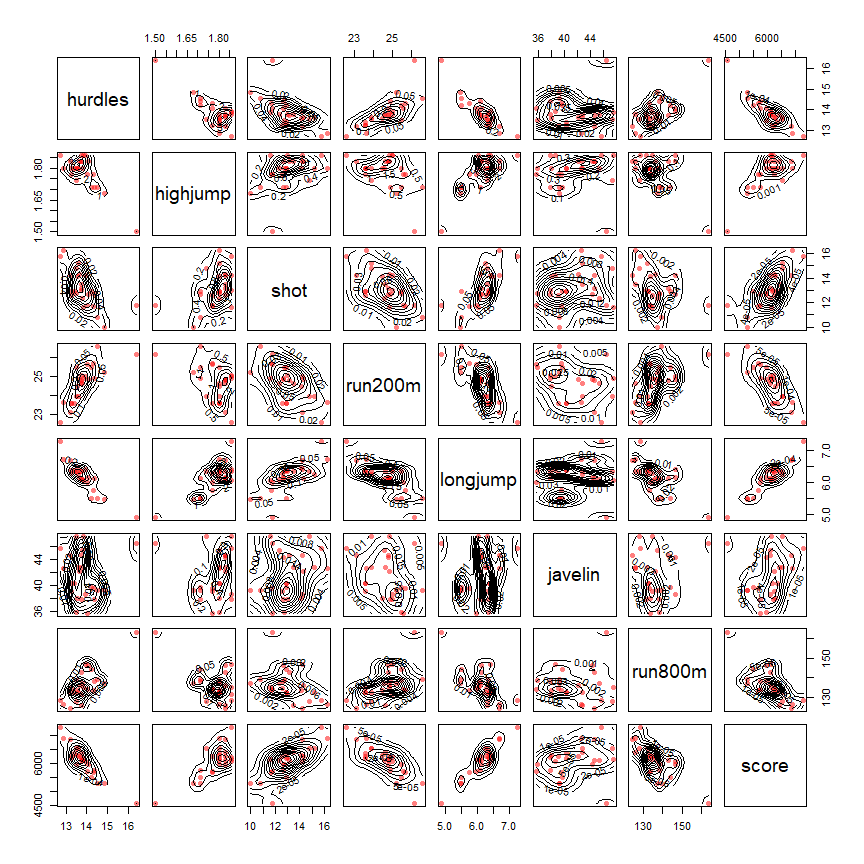<!-- -->

## Ex. 3.2 ————————————————

## Ex. 3.2 Construct a diagram that shows the SO2 variable in

## the air pollution data plotted against each of the six explanatory

## variables, and in each of the scatterplots show the fitted linear

## regression and a fitted locally weighted regression. Does this diagram

## help in deciding on the most appropriate model for determining the variables

## most predictive of sulphur dioxide levels?

``` r
### coding ---------------------------

dat2 <- USairpollution

names(dat2)
```

    ## [1] "SO2"     "temp"    "manu"    "popul"   "wind"    "precip"  "predays"

``` r
dat2 %>%
  pivot_longer(cols = names(dat2)[-1], values_to = 
  "Vals", names_to = "Vars") %>%
  ggplot(aes(x = Vals, y = SO2)) + 
  geom_point(size = 3, shape = 16, colour = 
               adjustcolor("gray4", alpha = .5)) + 
  geom_smooth(method = loess, formula = y ~ x, 
              se = F, aes(linetype = "Loess"), 
              colour = "blue", 
              method.args = list(span = .25)) +
  geom_smooth(method = lm, formula = y ~ x, 
              aes(linetype = "lm"), 
              se = F, colour = "tomato") + 
  facet_wrap(vars(Vars), nrow = 3, ncol = 2, 
             scales = "free_x") + 
  theme_bw() + 
  theme(legend.title = element_blank(), 
        legend.position = "bottom") + 
 guides(linetype = guide_legend(override.aes = list(color 
 = c("red", "blue")))) + 
  theme(legend.text = element_text(size = 20)) + 
      stat_fit_glance(method = "lm",
                    label.y = "top",
                    label.x = "center",
                    method.args = list(formula = y ~ x),
                    mapping = aes(label = 
                    sprintf('italic(r)^2~"="~%.3f~~italic(P[value])~"="~%.2g',
after_stat(r.squared), after_stat(p.value))),
                    parse = TRUE)
```

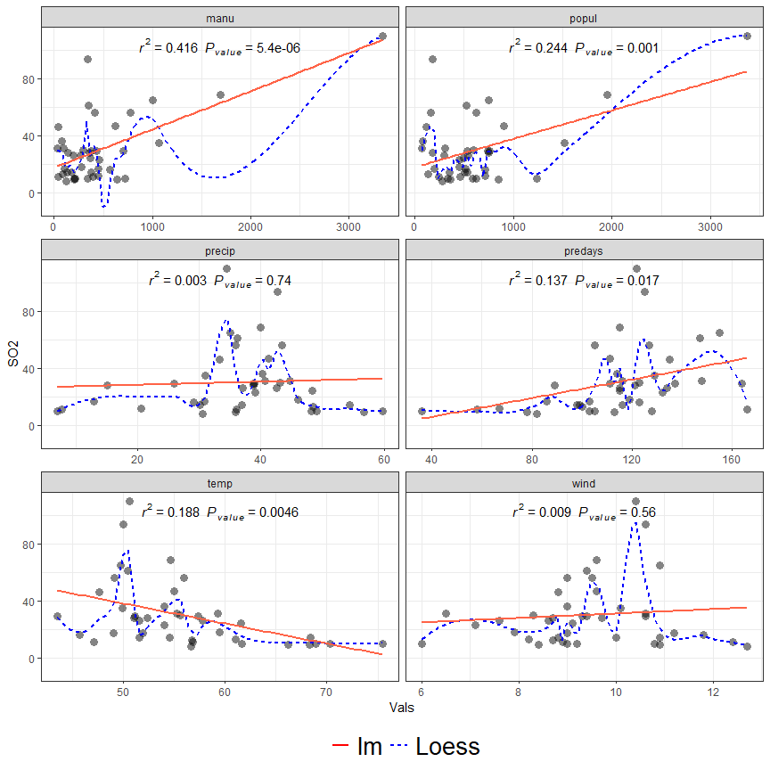<!-- -->

------------------------------------------------------------------------

## Ex. 3.3 ——————————————————

## Find the principal components of the

## following correlation matrix given by MacDonnell (1902)

## from measurements of seven physical characteristics in

## each of 3000 convicted criminals:

## How would you interpret the derived components?

``` r
### coding --------------------------------

fig <- image_read(file.choose())
plot(fig)
```

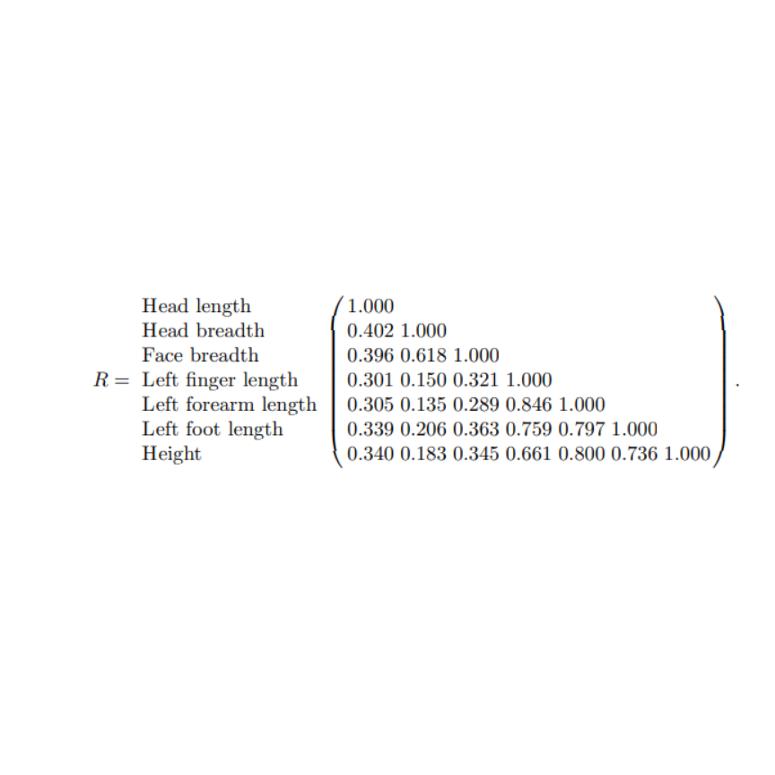<!-- -->

``` r
options(digits = 6)
dat3 <- read_delim(file =file.choose(), delim = "\n", 
col_names = FALSE)
Nam <- dat3[1:7, 1]$X1  
cor_r1 <- dat3[8:14, 1]$X1
Corr <- matrix(NA, 7, 7)
for(i in 1:7){
    temp1 <- cor_r1[i]
    res <- strsplit(temp1, " ")[[1]] %>% as.numeric
    Corr[i, 1:i] <- res; Corr[1:i, i] <- res
    
}

dimnames(Corr) <- list(abbreviate(Nam, minlength = 6, 
method = "both.sides"), abbreviate(Nam, minlength = 6, 
method = "both.sides"))

Corr
```

    ##        Hdlngt Hdbrdt Fcbrdt Lftfnl Lftfrl Lftftl Height
    ## Hdlngt  1.000  0.402  0.396  0.301  0.305  0.339  0.340
    ## Hdbrdt  0.402  1.000  0.618  0.150  0.135  0.206  0.183
    ## Fcbrdt  0.396  0.618  1.000  0.321  0.289  0.363  0.345
    ## Lftfnl  0.301  0.150  0.321  1.000  0.846  0.759  0.661
    ## Lftfrl  0.305  0.135  0.289  0.846  1.000  0.797  0.800
    ## Lftftl  0.339  0.206  0.363  0.759  0.797  1.000  0.736
    ## Height  0.340  0.183  0.345  0.661  0.800  0.736  1.000

``` r
dimnames(Corr) <- list(Nam, Nam)

corrplot(Corr, method = "number", type = "lower", 
         col = c("red", "green", "darkblue"), 
         number.digits = 3, tl.srt = 45)
```

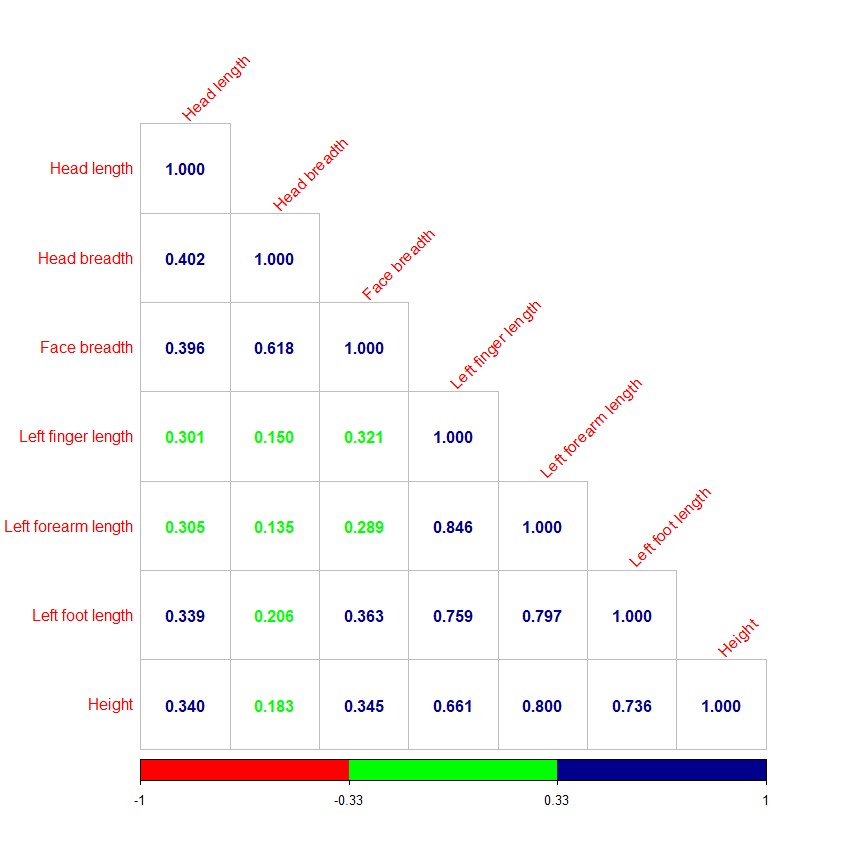<!-- -->

``` r
Model <- princomp(covmat = Corr)
summary(Model)
```

    ## Importance of components:
    ##                          Comp.1   Comp.2    Comp.3    Comp.4    Comp.5
    ## Standard deviation     1.949224 1.225695 0.8061063 0.6000474 0.5823766
    ## Proportion of Variance 0.542782 0.214618 0.0928296 0.0514367 0.0484518
    ## Cumulative Proportion  0.542782 0.757400 0.8502300 0.9016667 0.9501185
    ##                           Comp.6    Comp.7
    ## Standard deviation     0.4850290 0.3375164
    ## Proportion of Variance 0.0336076 0.0162739
    ## Cumulative Proportion  0.9837261 1.0000000

``` r
coord_pc <- get_pca_var(Model)

Cor_pc <- coord_pc$coord |> round(3)

#### draw plot correlation between pcs and vars ----------
corrplot(Cor_pc, method = "number", 
         type = "full", 
         is.corr = F, col = c("red", "green", "skyblue"), 
                              bg = "gray2", tl.col = "blue", 
         tl.srt = 45, title = 
         list("Correlations between PCs and Vars",
                                   col = "darkblue", 
                                   font = 3), 
         mar = c(0, 2, 2, 0), addgrid.col = "yellow")
```

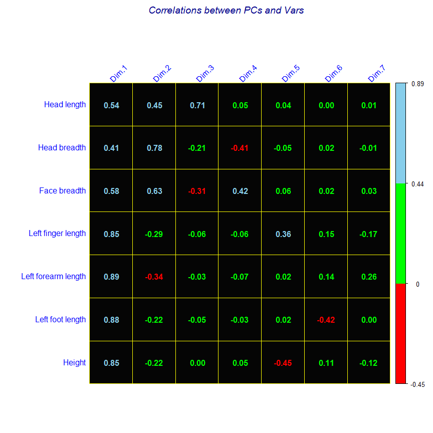<!-- -->

``` r
#### draw contribution plot for pcs and vars -----------

Contribut <- coord_pc$contrib |> round(3)

corrplot(Contribut, method = "number", 
         type = "full", 
         is.corr = F, col = c("red", "green", "skyblue"), 
                              bg = "gray2", tl.col = "blue", 
         tl.srt = 45, title = list("Contribution of Vars in Pcs",
                                   col = "darkblue", 
                                   font = 3), 
         mar = c(0, 2, 2, 0), addgrid.col = "yellow")
```

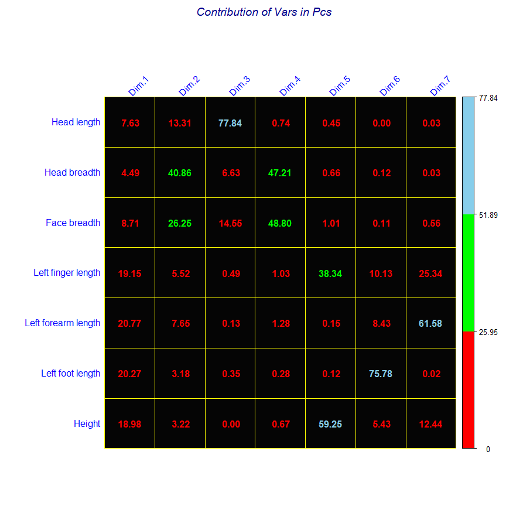<!-- -->

``` r
 #### draw Cos2 of between and Vars -------------------

Cosine2 <- coord_pc$cos2 |> round(3)
corrplot(Cosine2, method = "number", 
         type = "full", 
         is.corr = F, col = c("red", "green", "skyblue"), 
                              bg = "gray2", tl.col = "blue", 
         tl.srt = 45, title = list("Cosine2 between PCs and Vars",
                                   col = "darkblue", 
                                   font = 3), 
         mar = c(0, 2, 2, 0), addgrid.col = "yellow")
```

<!-- -->

``` r
fviz_screeplot(Model, addlabels = TRUE, 
               choice = "variance")
```

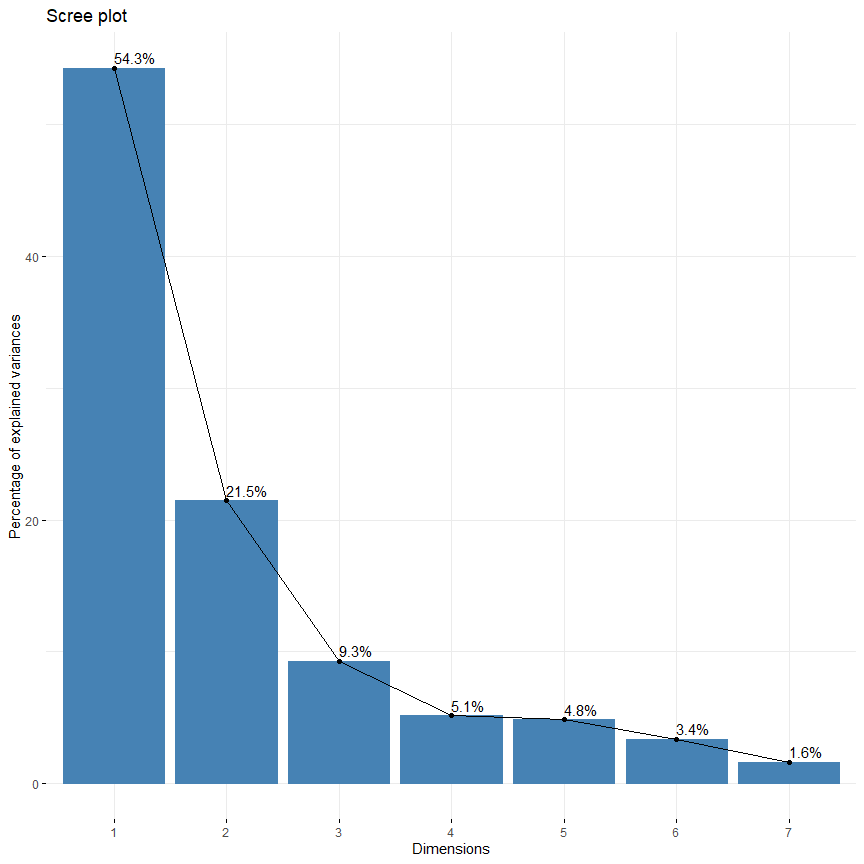<!-- -->

------------------------------------------------------------------------

# Ex. 3.4 ———————————————–

## Not all canonical correlations may be statistically

## significant. An approximate test proposed by Bartlett (1947)

## can be used to determine how many significant relationships exist.

## The test statistic for testing that at least one canonical

## correlation is significant is?

## Write R code to apply this test to the headsize data

## (Table 3.1) and the depression data (Table 3.3).

``` r
### coding --------------------------------------

"headsize" <- matrix(c(
191, 195, 181, 183, 176, 208, 189, 
197, 188, 192, 179, 183, 174, 
190, 188, 163, 195, 186, 181, 175, 192, 174,
176, 197, 190, 155, 149, 148, 153, 144, 157, 
150, 159, 152, 150, 158, 147, 150, 159, 151, 
137, 155, 153, 145, 140, 154, 143, 139, 167, 
163, 179, 201, 185, 188, 171, 192, 190, 189, 197, 
187, 186, 174, 185, 195, 187, 161, 183, 173, 182, 165, 
185, 178, 176, 200, 187, 145, 152, 149, 149, 142, 
152, 149, 152, 159, 151, 148, 147, 152, 157, 158, 130, 
158, 148, 146, 137, 152, 147, 143, 158, 150), 
nrow = 25, ncol = 4,  dimnames = list(character(0), 
c("head1", "breadth1", "head2", "breadth2"))) %>%
as.data.frame

get_chi <- function(x, ind1, ind2, method = "data", N = NULL){
if(method == "data"){
n <- nrow(x);
R = cor(x)}else {
R = x
n <- N
}
R11 <- R[ind1, ind1]; R22 <- R[ind2, ind2];
R12 <- R[ind1, ind2]; R21 <- R[ind2, ind1]
E1 <- solve(R11) %*% R12 %*% solve(R22) %*% R21
E2 <- solve(R22) %*% R21 %*% solve(R11) %*% R12
la1 <- eigen(E1)$values; la2 <- eigen(E2)$values
q1 <- length(la1); q2 <- length(la2)
s <- min(q1, q2)
if(s == q1) Lambda = la1 else Lambda = la2

RHO <- c()
Pval = c()
CHI <- c()

for(k in 0:(s-1)){
Lam <- Lambda[(k + 1):s]
print(Lam)
temp1 <- sum(log(1 - Lam))
print(temp1)

temp2 <- -(n - (1/2) * (q1 + q2 + 1))

print(temp2)
chi_star <- temp1 * temp2
pval <- 2 * min(c(pchisq(chi_star, df = (q1 - k)*(q2 - k), 
                         lower.tail = FALSE), 
                  pchisq(chi_star, df = (q1 - k)*(q2 - k), 
                         lower.tail = TRUE)))

CHI <- c(CHI, chi_star) 
RHO <- c(RHO, paste("rho", (k+1), sep = ":"))
Pval = c(Pval, pval)
}      
result <- tibble(Rho = RHO, `chi-value` = CHI, 
`p-value` = Pval)
return(result)         
}

res <- get_chi(x = headsize, ind1 = c(1, 2), ind2 = c(3, 4))
```

    ## [1] 0.62174473 0.00288796
    ## [1] -0.975078
    ## [1] -22.5
    ## [1] 0.00288796
    ## [1] -0.00289213
    ## [1] -22.5

``` r
res |>
knitr :: kable(x = _, 
format = "pipe", caption = "table of results", 
align = "c")
```

|  Rho  | chi-value | p-value  |
|:-----:|:---------:|:--------:|
| rho:1 | 21.939258 | 0.000412 |
| rho:2 | 0.065073  | 0.402699 |

table of results

``` r
####  

x1 <- headsize[, 1:2]; x2 <- headsize[, 3:4]
cca_model <- cc(x1, x2)

cca_model$cor
```

    ## [1] 0.7885079 0.0537397

``` r
library(CCP)

p <- ncol(x1)
q <- ncol(x2)
N <- nrow(x1)
rho <- cca_model$cor

p.asym(rho, N, p, q, tstat = "Wilks")
```

    ## Wilks' Lambda, using F-approximation (Rao's F):
    ##              stat   approx df1 df2     p.value
    ## 1 to 2:  0.377163 6.597193   4  42 0.000325646
    ## 2 to 2:  0.997112 0.063719   1  22 0.803055007

``` r
p.asym(rho, N, p, q, tstat = "Hotelling")
```

    ##  Hotelling-Lawley Trace, using F-approximation:
    ##                stat   approx df1 df2     p.value
    ## 1 to 2:  1.64661365 8.233068   4  40 6.08339e-05
    ## 2 to 2:  0.00289632 0.063719   1  44 8.01887e-01

``` r
p.asym(rho, N, p, q, tstat = "Pillai")
```

    ##  Pillai-Bartlett Trace, using F-approximation:
    ##                stat    approx df1 df2    p.value
    ## 1 to 2:  0.62463269 4.9957270   4  44 0.00208247
    ## 2 to 2:  0.00288796 0.0694112   1  48 0.79332378

``` r
#### depression data --------------

R_dep <- read_table(file.choose(), col_names = TRUE) %>%
  as.data.frame 
Nam <- names(R_dep)

R <- data.matrix(R_dep)

dimnames(R) <- list(Nam, Nam)
corrplot(R, method = "number", type = "full", 
         number.digits = 3, 
         col = c("red", "blue", "black"))
```

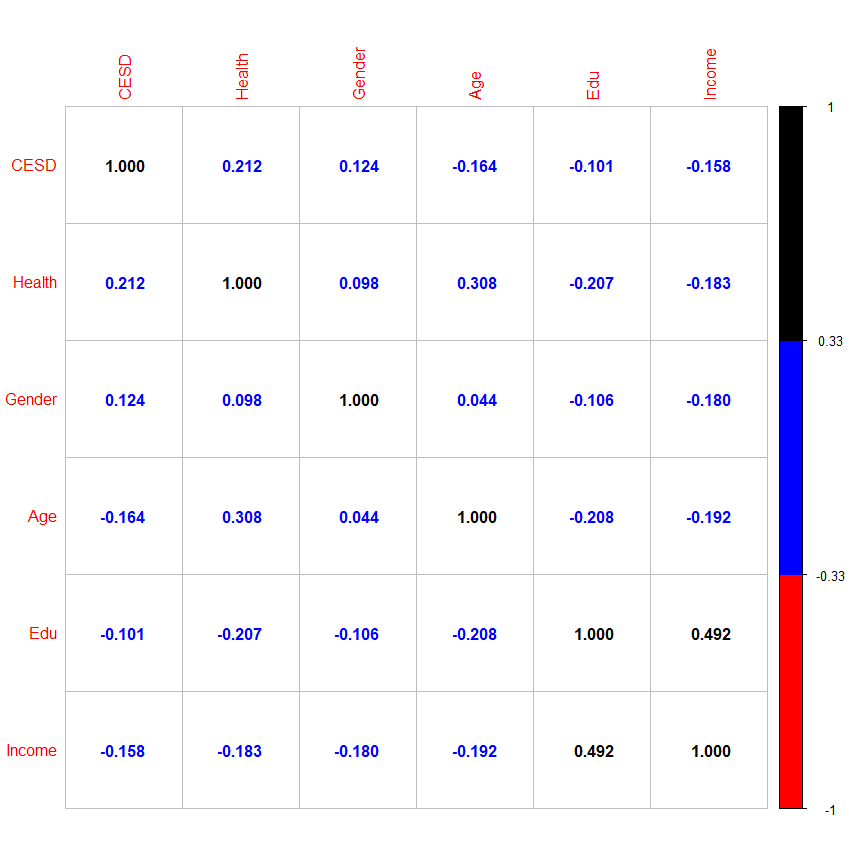<!-- -->

``` r
res <- get_chi(x = R, ind1 <<- c(1, 2), ind2 = -ind1, 
method = "cor", N = 294)
```

    ## [1] 0.153469 0.063474
    ## [1] -0.232187
    ## [1] -290.5
    ## [1] 0.063474
    ## [1] -0.065578
    ## [1] -290.5

``` r
res |>
knitr :: kable(x = _, 
format = "pipe", caption = "table of results", 
align = "c")
```

|  Rho  | chi-value | p-value  |
|:-----:|:---------:|:--------:|
| rho:1 |  67.4503  | 0.000000 |
| rho:2 |  19.0504  | 0.000534 |

table of results

------------------------------------------------------------------------

# Ex 3.5 ————————————–

## Repeat the regression analysis for the

## air pollution data described in the text after removing

## whatever cities you think should be regarded as outliers.

## For the results given in the text and the results from the

## outliers-removed data, produce scatterplots of sulphur

## dioxide concentration against each of the principal

## component scores. Interpret your results.

``` r
### coding ---------------------------------

#### temp get outlier--------------------
a1 <- dat2 %>% dplyr :: select(c("SO2", "temp"))
bvbox(cbind(a1$temp, a1$SO2), pch = "")
text(x = dat2$temp, y = dat2$SO2, labels = 1:41)
```

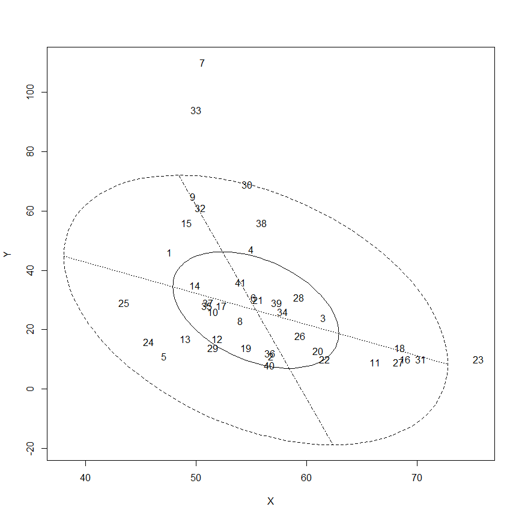<!-- -->

``` r
temp_ind <- c(7, 23, 33)

#### manu get outlier ---------------------
a1 <- dat2 %>% dplyr :: select(c("SO2", "manu"))
bvbox(cbind(a1$manu, a1$SO2), pch = "")
text(x = dat2$manu, y = dat2$SO2, labels = 1:41)
```

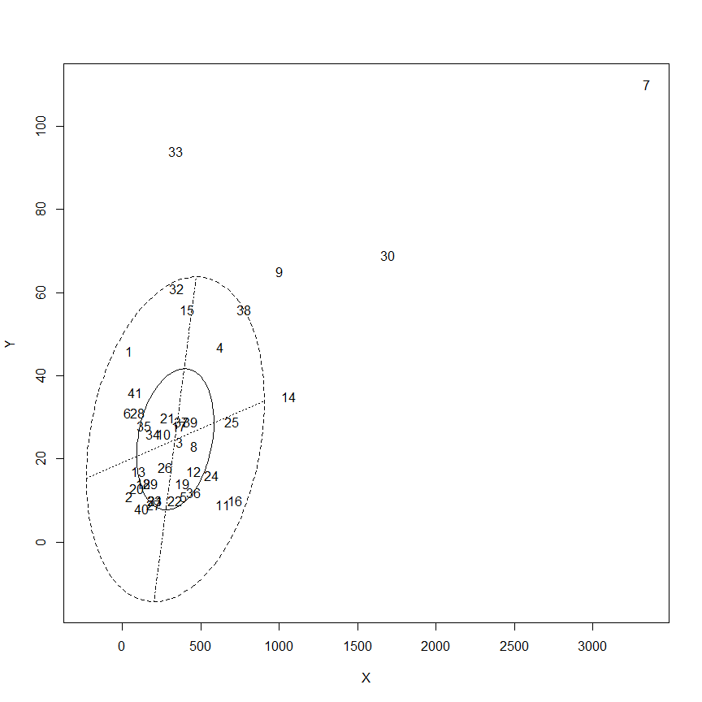<!-- -->

``` r
manu_ind <- c(7, 33, 9, 14, 30)

#### popul get outlier ----------------------
a1 <- dat2 %>% dplyr :: select(c("SO2", "popul"))
bvbox(cbind(a1$popul, a1$SO2), pch = "")
text(x = dat2$popul, y = dat2$SO2, labels = 1:41)
```

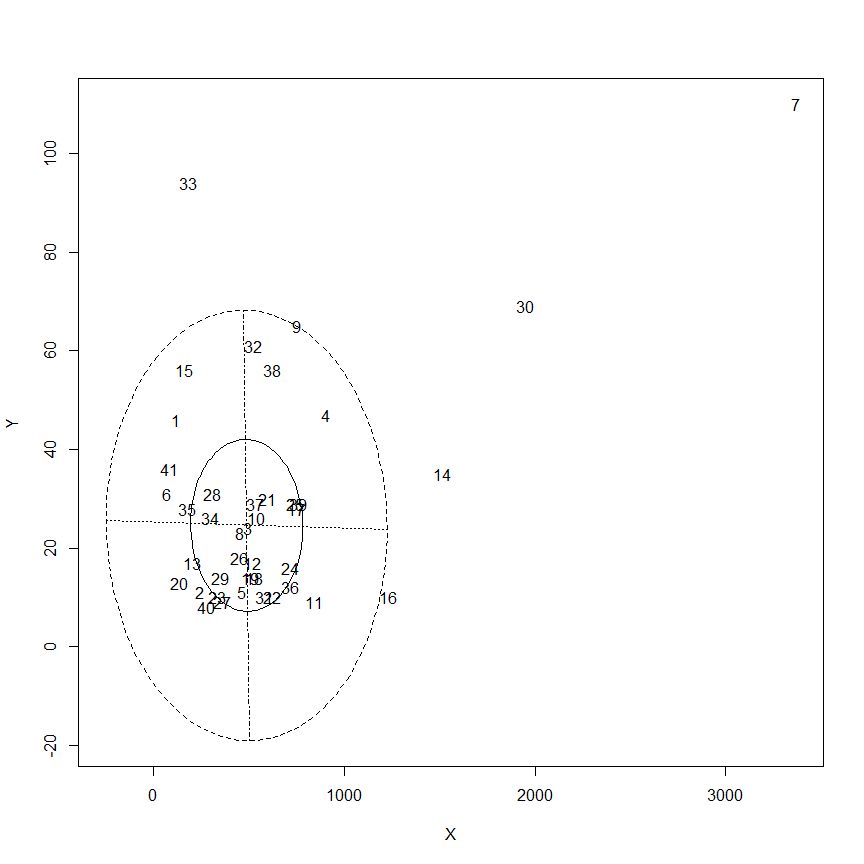<!-- -->

``` r
popul_ind <- c(7, 30, 14, 33, 16)

#### wind get outlier ---------------------------
a1 <- dat2 %>% dplyr :: select(c("SO2", "wind"))
bvbox(cbind(a1$wind, a1$SO2), pch = "")
text(x = dat2$wind, y = dat2$SO2, labels = 1:41)
```

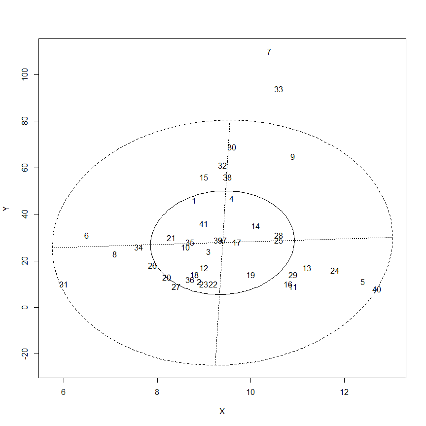<!-- -->

``` r
wind_ind <- c(7, 33)

#### precip get outlier -----------------------
a1 <- dat2 %>% dplyr :: select(c("SO2", "precip"))
bvbox(cbind(a1$precip, a1$SO2), pch = "")
text(x = dat2$precip, y = dat2$SO2, labels = 1:41)
```

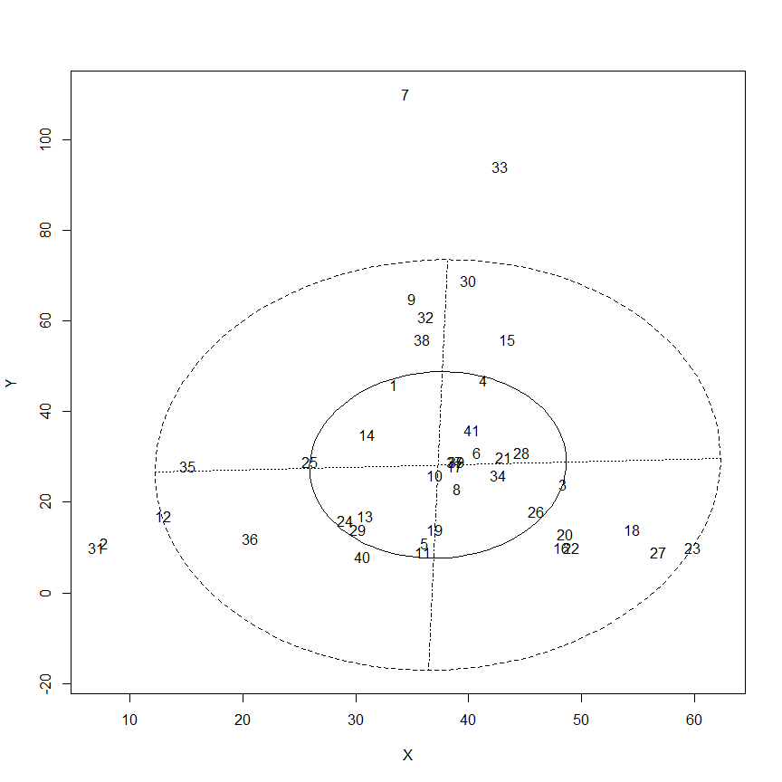<!-- -->

``` r
precip_ind <- c(7, 33, 31, 2)

#### predays get outlier ------------------------
a1 <- dat2 %>% dplyr :: select(c("SO2", "predays"))
bvbox(cbind(a1$predays, a1$SO2), pch = "")
text(x = dat2$predays, y = dat2$SO2, labels = 1:41)
```

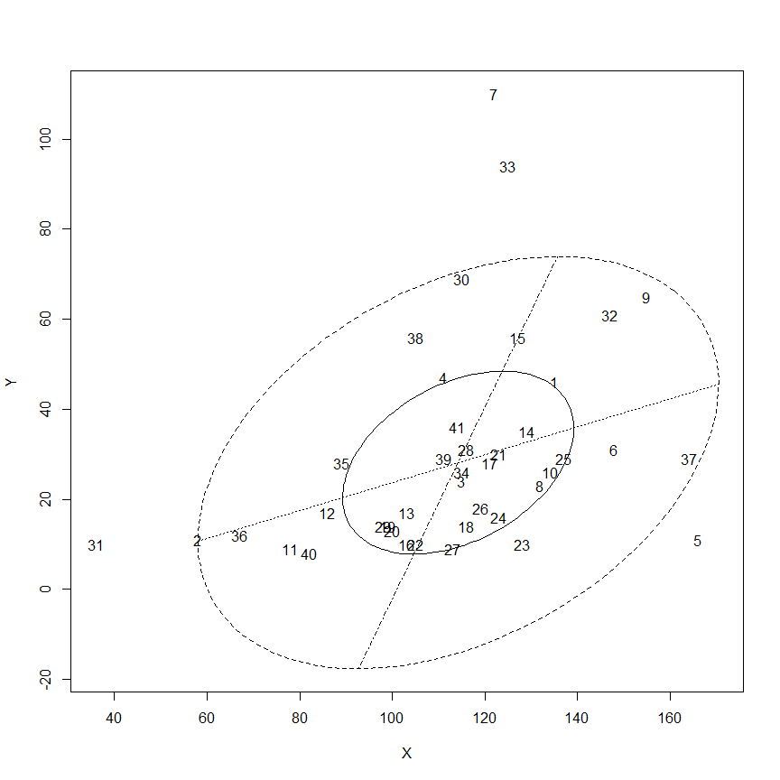<!-- -->

``` r
predays_ind <- c(7, 5, 31, 33)

out <- temp_ind |>
intersect(x = _, y = manu_ind) |>
intersect(x = _, y = popul_ind) |>
intersect(x = _, y = wind_ind) |>
intersect(x = _, y = precip_ind) |>
intersect(x = _, y = predays_ind)
out
```

    ## [1]  7 33

``` r
dat3 <- dat2 |>
slice(-out) 

Model <- PCA(dat3, ncp = 6, graph = FALSE)

Scores <- get_pca_ind(Model)$coord |>
as.data.frame() |>
mutate(So2 = dat3$SO2) |>
relocate("So2", .before = "Dim.1")
head(Scores)
```

    ##             So2     Dim.1     Dim.2       Dim.3     Dim.4     Dim.5      Dim.6
    ## Albany       46 -0.015967  1.778496 -1.42483186 -0.840231  0.331620  0.0333102
    ## Albuquerque  11 -2.243672 -1.888164 -2.00662421 -0.461332  0.187291  0.2731053
    ## Atlanta      24 -0.425971  0.384316  1.10936355  0.105912  0.186743 -0.0924673
    ## Baltimore    47  1.443798 -0.247578  0.48494821 -0.449264  0.595058 -0.2803515
    ## Buffalo      11  1.101429  1.237368 -1.07821294  2.393227 -0.905105  0.5262801
    ## Charleston   31 -1.093375  2.122281 -0.00245604 -1.582589 -0.732128  0.2485665

``` r
Scores %>%
  pivot_longer(cols = names(Scores)[-1], values_to = 
  "Vals", names_to = "Vars") %>%
  ggplot(aes(x = Vals, y = So2)) + 
  geom_point(size = 3, shape = 16, colour = 
               adjustcolor("gray4", alpha = .5)) + 
  geom_smooth(method = loess, formula = y ~ x, 
              se = F, aes(linetype = "Loess"), 
              colour = "blue", 
              method.args = list(span = .25)) +
  geom_smooth(method = lm, formula = y ~ x, 
              aes(linetype = "lm"), 
              se = F, colour = "tomato") + 
  facet_wrap(vars(Vars), nrow = 3, ncol = 2, 
             scales = "free_x") + 
  theme_bw() + 
  theme(legend.title = element_blank(), 
        legend.position = "bottom") + 
 guides(linetype = guide_legend(override.aes = 
 list(color = c("red", "blue")))) + 
  theme(legend.text = element_text(size = 20)) + 
      stat_fit_glance(method = "lm",
                    label.y = "top",
                    label.x = "center",
                    method.args = list(formula = y ~ x),
                    mapping = aes(label = 
sprintf('italic(r)^2~"="~%.3f~~italic(P[value])~"="~%.2g',
after_stat(r.squared), after_stat(p.value))),
                    parse = TRUE)
```

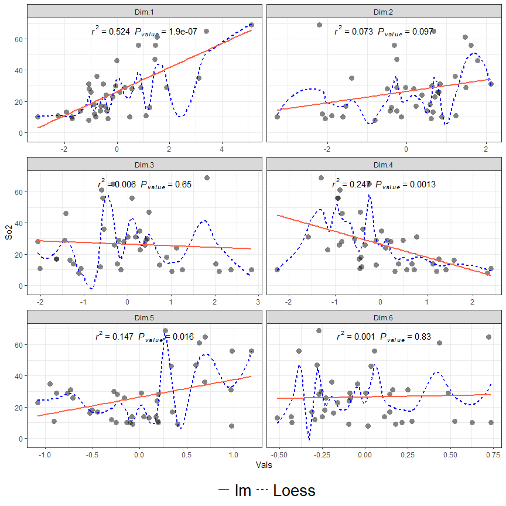<!-- -->

``` r
Model_reg <- Scores |>
lm(So2 ~ ., data = _)
coef(Model_reg)
```

    ## (Intercept)       Dim.1       Dim.2       Dim.3       Dim.4       Dim.5 
    ##    26.35897     7.69337     3.66476    -1.03772    -8.29772    11.18479 
    ##       Dim.6 
    ##     1.88005

``` r
summary(Model_reg)$coefficients %>%
as.data.frame %>%
knitr :: kable(captoin = "table of results", align = "c", 
format = "pipe")
```

|             | Estimate | Std. Error |  t value  | Pr(\>\|t\|) |
|:------------|:--------:|:----------:|:---------:|:-----------:|
| (Intercept) | 26.35897 |  0.149631  | 176.15950 |  0.000000   |
| Dim.1       | 7.69337  |  0.094627  | 81.30195  |  0.000000   |
| Dim.2       | 3.66477  |  0.120822  | 30.33188  |  0.000000   |
| Dim.3       | -1.03772 |  0.124114  | -8.36102  |  0.000000   |
| Dim.4       | -8.29772 |  0.148612  | -55.83473 |  0.000000   |
| Dim.5       | 11.18479 |  0.259321  | 43.13103  |  0.000000   |
| Dim.6       | 1.88005  |  0.465265  |  4.04080  |  0.000312   |

``` r
glance(Model_reg) %>%
t %>%
as.data.frame %>%
setNames(., "value") %>%
knitr :: kable(caption = "result2", align = "c", 
format = "pipe")
```

|               |    value    |
|:--------------|:-----------:|
| r.squared     |  0.997466   |
| adj.r.squared |  0.996990   |
| sigma         |  0.934447   |
| statistic     | 2099.011147 |
| p.value       |  0.000000   |
| df            |  6.000000   |
| logLik        | -48.836793  |
| AIC           | 113.673587  |
| BIC           | 126.982080  |
| deviance      |  27.942128  |
| df.residual   |  32.000000  |
| nobs          |  39.000000  |

result2

------------------------------------------------------------------------
